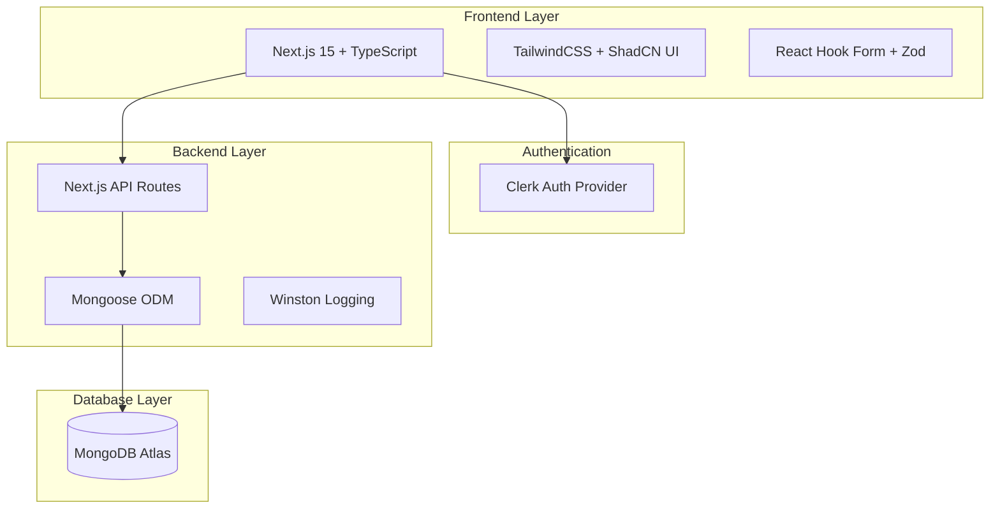

# 📚 ClaimBot Documentation Hub

> **Complete documentation reference for the Internal Claims & Overtime Management System**

Welcome to the ClaimBot documentation center. This hub provides organized access to all project documentation, from business requirements to technical specifications and user guides.

---

## 📋 **Documentation Index**

### **📋 Project Foundation**
| Document | Description | Audience |
|----------|-------------|----------|
| **[Business Requirements (BRS)](01-brs-claimbot.md)** | Project objectives, scope, and business rules | All stakeholders |
| **[System Design (SDS)](02-sds-claimbot.md)** | Technical architecture, database schema, API design | Developers, Architects |
| **[Development Plan](05-development-plan-claimbot.md)** | Phased development approach and timelines | Project managers, Developers |

### **🎨 User Experience & Design**
| Document | Description | Audience |
|----------|-------------|----------|
| **[UI Wireframes](03-wireframe-claimbot.md)** | Visual layout and user interface mockups | Designers, Developers |
| **[Component Specifications](04-companion-spec-claimbot.md)** | UI component architecture and flows | Frontend developers |

### **🔧 Technical Reference**
| Document | Description | Audience |
|----------|-------------|----------|
| **[Technical Architecture](06-technical-architecture.md)** | Comprehensive system architecture and design patterns | Developers, Architects |
| **[Deployment Guide](07-deployment-guide.md)** | Production deployment, Docker, CI/CD, monitoring | DevOps, System Admins |
| **[Google Maps Integration](08-google-maps-integration-guide.md)** | Complete Google Maps API setup and integration guide | Developers, DevOps |
| **[API Documentation](swagger.yaml)** | Complete REST API specification (OpenAPI 3.0) | Developers, Integrators |
| **[Technical Decision Log](00-technical-decision-log.md)** | Architecture decisions and rationale | Developers, Architects |
| **[Debug & Issues List](00-debug-list.md)** | Known issues, bugs, and TODO items | Developers, QA |

---

## 🎯 **Quick Navigation by Role**

### **👤 For Staff Users**
- **Getting Started**: [Main README](../README.md#quick-start) → Quick setup and first steps
- **User Guide**: [Wireframes - Staff Interface](03-wireframe-claimbot.md#staff-user-interface) → How to submit claims and overtime
- **Features**: [BRS - Stakeholder Roles](01-brs-claimbot.md#3-stakeholder-roles) → What you can do

### **👨‍💼 For Managers**
- **Approval Workflow**: [Wireframes - Manager Interface](03-wireframe-claimbot.md#manager-interface) → Review and approve submissions
- **Business Rules**: [BRS - Approval Workflow](01-brs-claimbot.md#46-approval-workflow) → Understanding the approval process

### **🏢 For Administrators**
- **System Setup**: [Technical Architecture](06-technical-architecture.md#-system-architecture-overview) → Technical overview
- **User Management**: [Wireframes - Admin Panel](03-wireframe-claimbot.md#admin-panel) → Managing users and settings
- **Rate Configuration**: [BRS - Business Rules](01-brs-claimbot.md#4-business-rules-and-logic) → Understanding calculation rules

### **👨‍💻 For Developers**
- **Quick Start**: [Main README](../README.md#quick-start) → Development environment setup
- **Contributing**: [Contributing Guide](../CONTRIBUTING.md) → Development workflow and standards
- **API Reference**: [Swagger Documentation](swagger.yaml) → Complete API specification
- **Architecture**: [Technical Architecture](06-technical-architecture.md) → Comprehensive system design
- **Google Maps Setup**: [Google Maps Integration](08-google-maps-integration-guide.md) → Location system API configuration
- **Technical Decisions**: [Decision Log](00-technical-decision-log.md) → Why we chose specific technologies

### **🚀 For DevOps Engineers**
- **Deployment**: [Deployment Guide](07-deployment-guide.md) → Production deployment strategies
- **Docker**: [Deployment Guide - Docker](07-deployment-guide.md#-docker-deployment) → Containerization setup
- **CI/CD**: [Deployment Guide - Pipeline](07-deployment-guide.md#-cicd-pipeline) → Automated deployment
- **Monitoring**: [Deployment Guide - Monitoring](07-deployment-guide.md#-monitoring--logging) → System monitoring

---

## 📊 **Documentation Status**

### **✅ Complete Documentation**
- ✅ **Business Requirements**: Comprehensive scope and objectives
- ✅ **System Design**: Full technical specification
- ✅ **UI Wireframes**: Complete user interface mockups
- ✅ **Component Specs**: Frontend architecture guide
- ✅ **Development Plan**: Phased approach with timelines
- ✅ **Technical Architecture**: Comprehensive system design and patterns
- ✅ **Deployment Guide**: Production deployment and operations
- ✅ **Google Maps Integration**: Complete API setup and integration guide
- ✅ **API Documentation**: OpenAPI 3.0 specification
- ✅ **Technical Decisions**: Architecture rationale log
- ✅ **Issue Tracking**: Current bugs and TODO items

### **🔄 Living Documents**
- 🔄 **Technical Decision Log**: Updated with each architectural choice
- 🔄 **Debug List**: Continuously updated with issues and resolutions
- 🔄 **API Documentation**: Maintained with endpoint changes
- 🔄 **Deployment Guide**: Updated with new deployment strategies

---

## 🏗️ **System Architecture Overview**



**📖 Detailed Architecture**: See [Technical Architecture Guide](06-technical-architecture.md)

---

## 📋 **Database Collections**

| Collection | Purpose | Key Fields |
|------------|---------|------------|
| **users** | User accounts and profiles | clerkId, role, salary, department |
| **claims** | Expense claim submissions | userId, expenses, status, attachments |
| **overtime** | Overtime request submissions | userId, hours, rate, justification |
| **files** | Document attachments | filename, path, linkedTo |
| **audit_logs** | System activity tracking | userId, action, timestamp |
| **rates_config** | Calculation rate settings | type, value, effectiveDate |

**📖 Detailed Schema**: See [Technical Architecture - Database Schema](06-technical-architecture.md#-database-schema--design)

---

## 🔍 **API Endpoint Categories**

### **Authentication & Users**
- `GET /api/auth/profile` - Get current user profile
- `GET /api/users` - List all users (admin)
- `POST /api/users` - Create new user (admin)
- `PATCH /api/users/[id]` - Update user (admin)

### **Claims Management**
- `GET /api/claims` - List claims (filtered by role)
- `POST /api/claims` - Create new claim
- `POST /api/claims/[id]/submit` - Submit for approval
- `POST /api/claims/[id]/approve` - Approve/reject claim

### **Overtime Management**
- `GET /api/overtime` - List overtime requests
- `POST /api/overtime` - Create overtime request
- `POST /api/overtime/[id]/submit` - Submit for approval
- `POST /api/overtime/[id]/approve` - Approve/reject request

### **Configuration & Admin**
- `GET /api/config/rates` - Get rate configurations
- `POST /api/config/rates` - Create rate configuration
- `GET /api/audit-logs` - View system audit logs
- `POST /api/upload` - Upload file attachments

### **Location & Mileage**
- `POST /api/mileage/calculate` - Calculate distance between locations
- `GET /api/mileage/calculate` - Get office location configuration

**📖 Complete API Reference**: See [Swagger Documentation](swagger.yaml)

---

## 🧪 **Testing Documentation**

### **Backend Testing**
- **Integration Tests**: Complete API route testing with Supertest
- **Coverage**: 95%+ of all backend endpoints
- **TypeScript**: Strict mode compliance across all test files
- **Mocking**: Consistent patterns using Jest mocking

### **Frontend Testing**
- **Component Tests**: React Testing Library for UI components
- **Page Tests**: Integration testing for Next.js pages
- **Utility Tests**: Jest testing for helper functions

### **Test Execution**
```bash
# Run all tests
npm test

# Backend integration tests
npm run test:backend

# Frontend component tests
npm run test:frontend

# Coverage report
npm run test:coverage
```

**📖 Detailed Testing**: See [Technical Architecture - Testing](06-technical-architecture.md#-testing-architecture)

---

## 🚀 **Development Phases**

| Phase | Status | Description |
|-------|--------|-------------|
| **Phase 1** | ✅ Complete | Foundation & Core Backend |
| **Phase 2** | ✅ Complete | Claims & Overtime Backend |
| **Phase 3** | ✅ Complete | Frontend Core & Staff Modules |
| **Phase 4** | ✅ Complete | Manager & Admin Modules |
| **Phase 5** | 🔄 Next | Deployment & Monitoring |
| **Phase 6** | 🔮 Future | Post-Launch & AI Enhancements |

**📖 Detailed Plan**: See [Development Plan](05-development-plan-claimbot.md)

---

## 🚀 **Deployment Options**

### **Recommended Platforms**

| Platform | Best For | Complexity | Cost |
|----------|----------|------------|------|
| **[Vercel](07-deployment-guide.md#vercel-recommended-for-nextjs)** | Quick deployment, Next.js optimization | Low | $ |
| **[AWS ECS/Fargate](07-deployment-guide.md#aws-ecsfargate-deployment)** | Production scale, full control | High | $$ |
| **[Google Cloud Run](07-deployment-guide.md#google-cloud-run)** | Serverless, auto-scaling | Medium | $ |
| **[Docker](07-deployment-guide.md#-docker-deployment)** | Any environment, portability | Medium | Varies |

### **Quick Deployment**
```bash
# Vercel (Recommended)
npm i -g vercel
vercel --prod

# Docker
docker build -t claimbot .
docker run -p 3000:3000 claimbot

# Docker Compose
docker-compose up -d
```

**📖 Complete Deployment Guide**: See [Deployment Guide](07-deployment-guide.md)

---

## 📞 **Documentation Support**

### **How to Use This Hub**
1. **Start with the BRS** if you're new to the project
2. **Refer to Technical Architecture** for implementation details
3. **Use Wireframes** for UI/UX understanding
4. **Check API docs** for integration work
5. **Review Decision Log** for architecture context
6. **Follow Deployment Guide** for production setup

### **Document Structure**
- **📋 Foundation**: Business requirements and planning
- **🎨 Design**: User experience and interface design
- **🔧 Technical**: Architecture, deployment, and operations
- **🔄 Living**: Continuously updated documents

### **Contributing to Documentation**
- All documentation follows Markdown format
- Include version numbers and last update dates
- Cross-reference related documents
- Update the hub index when adding new documents
- See [Contributing Guide](../CONTRIBUTING.md) for standards

### **Getting Help**
- **Technical Questions**: Review the Technical Architecture and Decision Log
- **Business Context**: Refer to the Business Requirements
- **Implementation Details**: Check the System Design Specification
- **Deployment Issues**: See the Deployment Guide
- **Current Issues**: Check the Debug List
- **Development Setup**: Follow the Contributing Guide

---

## 📈 **Documentation Metrics**

### **Coverage Completeness**
- ✅ **Business Layer**: 100% documented (BRS, wireframes)
- ✅ **Technical Layer**: 100% documented (architecture, API, deployment)
- ✅ **Process Layer**: 100% documented (development, contributing)
- ✅ **Operations Layer**: 100% documented (deployment, monitoring)

### **Document Maintenance**
- **Total Documents**: 11 core documents
- **Last Full Review**: June 5, 2025
- **Update Frequency**: Living documents updated per change
- **Review Cycle**: Quarterly comprehensive review

---

**📝 Last Updated**: June 5, 2025
**📚 Total Documents**: 11 core documents
**🏗️ Status**: Phase 4 Complete - Production Ready
**📖 Coverage**: Complete end-to-end documentation

---

*Comprehensive documentation for a modern, full-stack expense and overtime management system* 📋✨