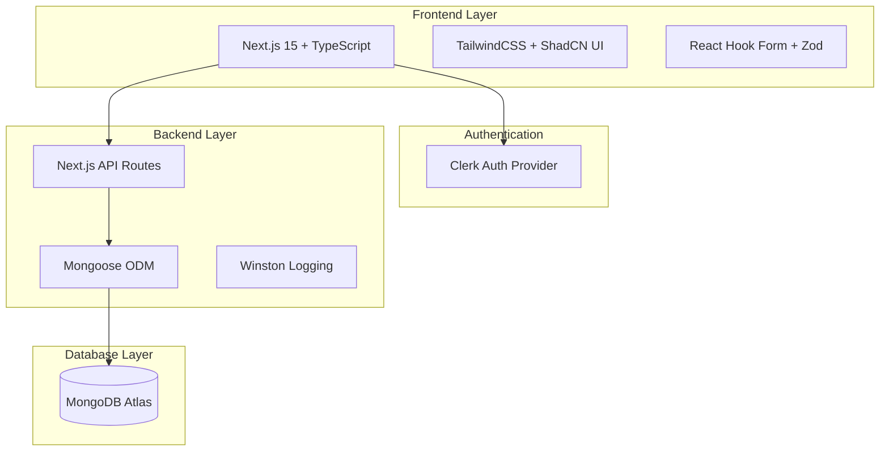

# 📚 ClaimBot Documentation Hub

> **Complete documentation reference for the Internal Claims & Overtime Management System**

Welcome to the ClaimBot documentation center. This hub provides organized access to all project documentation, from business requirements to technical specifications and user guides.

---

## 📋 **Documentation Index**

### **📋 Project Foundation**
| Document | Description | Audience |
|----------|-------------|----------|
| **[Project Summary](project-summary.md)** | Executive overview and current system status | All stakeholders |
| **[Business Requirements (BRS)](business-requirements-specification.md)** | Project objectives, scope, and business rules | All stakeholders |
| **[System Design (SDS)](system-design-specification.md)** | Technical architecture, database schema, API design | Developers, Architects |
| **[Development Plan](development-plan.md)** | Phased development approach and timelines | Project managers, Developers |

### **🎨 User Experience & Design**
| Document | Description | Audience |
|----------|-------------|----------|
| **[UI Wireframes](guides/design/wireframes.md)** | Visual layout and user interface mockups | Designers, Developers |

### **🏗️ Architecture & Design**
| Document | Description | Audience |
|----------|-------------|----------|
| **[System Overview](architecture/system-overview.md)** | High-level architecture and component relationships | Developers, Architects |
| **[Technical Architecture](architecture/technical-architecture.md)** | Comprehensive system architecture and design patterns | Developers, Architects |
| **[Technical Decision Log](architecture/technical-decision-log.md)** | Architecture decisions and rationale | Developers, Architects |
| **[Location System Specification](architecture/location-system-specification.md)** | Location and mileage calculation system design | Developers, Architects |
| **[Salary Verification Architecture](architecture/salary-verification-architecture.md)** | Future salary verification and overtime system design | Developers, Architects |

### **📖 User Guides & Workflows**
| Document | Description | Audience |
|----------|-------------|----------|
| **[Claim Submission Workflow](guides/workflows/claim-submission.md)** | End-to-end expense claim submission and approval process | Staff, Managers |
| **[Overtime Submission Workflow](guides/workflows/overtime-submission.md)** | Overtime request submission and approval process | Staff, Managers |
| **[Salary Verification Workflow](guides/workflows/salary-verification.md)** | Salary submission and verification process | Staff, Admins |
| **[User Management Workflow](guides/workflows/user-management.md)** | User account creation and role management | Administrators |
| **[Submit Expense Page Guide](guides/pages/submit-expense.md)** | Detailed guide for the expense submission page | Staff, Developers |

### **📚 Technical Reference**
| Document | Description | Audience |
|----------|-------------|----------|
| **[API Routes Encyclopedia](reference/api-routes.md)** | Complete API endpoint documentation | Developers, Integrators |
| **[Data Models Reference](reference/data-models.md)** | Database schema and model definitions | Developers, Architects |
| **[Component Specifications](reference/components/component-specifications.md)** | UI component architecture and flows | Frontend developers |
| **[DataTable Component](reference/components/datatable.md)** | DataTable component usage and configuration | Frontend developers |
| **[Location Autocomplete Component](reference/components/location-autocomplete.md)** | Location autocomplete component guide | Frontend developers |

### **🔧 Technical Implementation**
| Document | Description | Audience |
|----------|-------------|----------|
| **[RBAC & Authentication](technical/rbac-and-auth.md)** | Role-based access control implementation | Developers, Security |
| **[Google Places Implementation](technical/google-places-implementation.md)** | Google Places API integration and location system | Developers |
| **[Utility Library Reference](technical/utility-library.md)** | Helper functions and utility documentation | Developers |
| **[Gaps & Issues Report](technical/gaps-and-issues.md)** | Known limitations and improvement areas | Developers, QA |

### **🚀 Operations & Deployment**
| Document | Description | Audience |
|----------|-------------|----------|
| **[Deployment Guide](guides/deployment-guide.md)** | Production deployment, Docker, CI/CD, monitoring | DevOps, System Admins |
| **[Google Maps Integration](guides/google-maps-integration-guide.md)** | Complete Google Maps API setup and integration guide | Developers, DevOps |
| **[API Documentation](swagger.yaml)** | Complete REST API specification (OpenAPI 3.0) | Developers, Integrators |

### **📝 Development & Archive**
| Document | Description | Audience |
|----------|-------------|----------|
| **[Historical Debug List](archive/debug-list-historical.md)** | Historical issues and resolved bugs (archived) | Developers, QA |

---

## 🎯 **Quick Navigation by Role**

### **👤 For Staff Users**
- **Getting Started**: [Main README](../README.md#quick-start) → Quick setup and first steps
- **Submit Claims**: [Claim Submission Workflow](guides/workflows/claim-submission.md) → How to submit expense claims
- **Submit Overtime**: [Overtime Submission Workflow](guides/workflows/overtime-submission.md) → How to submit overtime requests
- **Salary Setup**: [Salary Verification Workflow](guides/workflows/salary-verification.md) → How to submit salary for verification

### **👨‍💼 For Managers**
- **Approval Process**: [Claim Submission Workflow](guides/workflows/claim-submission.md#32-claim-approvalrejection-by-approver) → Review and approve submissions
- **Overtime Approval**: [Overtime Submission Workflow](guides/workflows/overtime-submission.md#32-overtime-approvalrejection-by-approver) → Review overtime requests
- **Salary Verification**: [Salary Verification Workflow](guides/workflows/salary-verification.md#32-adminmanager-verifies-salary-submission) → Verify employee salaries

### **🏢 For Administrators**
- **System Overview**: [System Overview](architecture/system-overview.md) → High-level architecture understanding
- **User Management**: [User Management Workflow](guides/workflows/user-management.md) → Managing users and roles
- **Technical Architecture**: [Technical Architecture](architecture/technical-architecture.md) → Comprehensive system design
- **RBAC Configuration**: [RBAC & Authentication](technical/rbac-and-auth.md) → Role and permission management

### **👨‍💻 For Developers**
- **Quick Start**: [Main README](../README.md#quick-start) → Development environment setup
- **Contributing**: [Contributing Guide](../CONTRIBUTING.md) → Development workflow and standards
- **API Reference**: [API Routes Encyclopedia](reference/api-routes.md) → Complete API specification
- **Data Models**: [Data Models Reference](reference/data-models.md) → Database schema and relationships
- **Architecture**: [System Overview](architecture/system-overview.md) → System design overview
- **Components**: [Component References](reference/components/) → UI component documentation
- **Technical Details**: [Technical Implementation](technical/) → Implementation specifics

### **🚀 For DevOps Engineers**
- **Deployment**: [Deployment Guide](guides/deployment-guide.md) → Production deployment strategies
- **Google Maps Setup**: [Google Maps Integration](guides/google-maps-integration-guide.md) → External API configuration
- **API Documentation**: [Swagger Documentation](swagger.yaml) → Complete API specification

---

## 📊 **Documentation Organization**

### **📁 Folder Structure**
```
docs/
├── 📋 Project Foundation (root)
│   ├── project-summary.md (Executive Overview)
│   ├── business-requirements-specification.md (Business Requirements)
│   ├── system-design-specification.md (System Design)
│   └── development-plan.md (Development Plan)
├── 🏗️ architecture/
│   ├── system-overview.md (High-level Architecture)
│   ├── technical-architecture.md (Comprehensive Technical Architecture)
│   ├── technical-decision-log.md (Architecture Decisions)
│   ├── location-system-specification.md (Location System Design)
│   └── salary-verification-architecture.md (Future Salary System)
├── 📖 guides/
│   ├── deployment-guide.md (Production Deployment Guide)
│   ├── google-maps-integration-guide.md (Google Maps Setup Guide)
│   ├── design/ (UI/UX Design Documents)
│   │   └── wireframes.md
│   ├── workflows/ (Business Process Workflows)
│   │   ├── claim-submission.md
│   │   ├── overtime-submission.md
│   │   ├── salary-verification.md
│   │   └── user-management.md
│   └── pages/ (Page-specific Guides)
│       └── submit-expense.md
├── 📚 reference/
│   ├── api-routes.md (API Documentation)
│   ├── data-models.md (Database Schema)
│   └── components/ (UI Component References)
│       ├── component-specifications.md
│       ├── datatable.md
│       └── location-autocomplete.md
├── 🔧 technical/
│   ├── rbac-and-auth.md (Security Implementation)
│   ├── google-places-implementation.md (Location API Integration)
│   ├── utility-library.md (Helper Functions)
│   └── gaps-and-issues.md (Known Issues)
└── 📁 archive/
    └── debug-list-historical.md (Historical Debug Data)
```

### **📖 Document Categories**

#### **🏗️ Architecture Documents**
High-level system design, architectural decisions, and technical overview documents.

#### **📖 Workflow Guides**
Step-by-step business process documentation with sequence diagrams and user flows.

#### **📚 Reference Materials**
Technical documentation for APIs, database models, and UI components.

#### **🔧 Technical Implementation**
Detailed implementation guides for specific technical aspects of the system.

---

## 🏗️ **System Architecture Overview**



**📖 Detailed Architecture**: See [System Overview](architecture/system-overview.md) and [Technical Architecture](architecture/technical-architecture.md)

---

## 📋 **Database Collections**

| Collection | Purpose | Key Fields |
|------------|---------|------------|
| **users** | User accounts and profiles | clerkId, role, salary, department |
| **claims** | Expense claim submissions | userId, expenses, status, attachments |
| **overtime** | Overtime request submissions | userId, hours, rate, justification |
| **files** | Document attachments | filename, path, linkedTo |
| **audit_logs** | System activity tracking | userId, action, timestamp |
| **rates_config** | Calculation rate settings | type, value, effectiveDate |

**📖 Detailed Schema**: See [Data Models Reference](reference/data-models.md)

---

## 🔍 **API Endpoint Categories**

### **Authentication & Users**
- `GET /api/auth/profile` - Get current user profile
- `GET /api/users` - List all users (admin)
- `POST /api/users` - Create new user (admin)
- `PATCH /api/users/[id]` - Update user (admin)

### **Claims Management**
- `GET /api/claims` - List claims (filtered by role)
- `POST /api/claims` - Create new claim
- `POST /api/claims/[id]/submit` - Submit for approval
- `POST /api/claims/[id]/approve` - Approve/reject claim

### **Overtime Management**
- `GET /api/overtime` - List overtime requests
- `POST /api/overtime` - Create overtime request
- `POST /api/overtime/[id]/submit` - Submit for approval
- `POST /api/overtime/[id]/approve` - Approve/reject request

### **Configuration & Admin**
- `GET /api/config/rates` - Get rate configurations
- `POST /api/config/rates` - Create rate configuration
- `GET /api/audit-logs` - View system audit logs
- `POST /api/upload` - Upload file attachments

### **Location & Mileage**
- `POST /api/mileage/calculate` - Calculate distance between locations
- `GET /api/mileage/calculate` - Get office location configuration

**📖 Complete API Reference**: See [API Routes Encyclopedia](reference/api-routes.md) and [Swagger Documentation](swagger.yaml)

---

## 🚀 **Development Phases**

| Phase | Status | Description |
|-------|--------|-------------|
| **Phase 1** | ✅ Complete | Foundation & Core Backend |
| **Phase 2** | ✅ Complete | Claims & Overtime Backend |
| **Phase 3** | ✅ Complete | Frontend Core & Staff Modules |
| **Phase 4** | ✅ Complete | Manager & Admin Modules |
| **Phase 5** | ✅ Complete | RBAC Enhancement & Unified Admin |
| **Phase 6** | ✅ Complete | Location System & Google Maps Integration |
| **Phase 7** | 🔄 Future | Salary Verification & Advanced Features |

**📖 Detailed Plan**: See [Development Plan](development-plan.md)

---

## 🚀 **Deployment Options**

### **Recommended Platforms**

| Platform | Best For | Complexity | Cost |
|----------|----------|------------|------|
| **[Vercel](guides/deployment-guide.md#vercel-recommended-for-nextjs)** | Quick deployment, Next.js optimization | Low | $ |
| **[AWS ECS/Fargate](guides/deployment-guide.md#aws-ecsfargate-deployment)** | Production scale, full control | High | $$ |
| **[Google Cloud Run](guides/deployment-guide.md#google-cloud-run)** | Serverless, auto-scaling | Medium | $ |
| **[Docker](guides/deployment-guide.md#-docker-deployment)** | Any environment, portability | Medium | Varies |

### **Quick Deployment**
```bash
# Vercel (Recommended)
npm i -g vercel
vercel --prod

# Docker
docker build -t claimbot .
docker run -p 3000:3000 claimbot

# Docker Compose
docker-compose up -d
```

**📖 Complete Deployment Guide**: See [Deployment Guide](guides/deployment-guide.md)

---

## 📞 **Documentation Support**

### **How to Use This Hub**
1. **Start with the BRS** if you're new to the project
2. **Review System Overview** for architectural understanding
3. **Follow Workflows** for process understanding
4. **Use Reference docs** for implementation details
5. **Check Technical docs** for specific implementations
6. **Follow Deployment Guide** for production setup

### **Document Structure**
- **📋 Foundation**: Business requirements and planning (root level)
- **🏗️ Architecture**: System design and technical overview
- **📖 Guides**: User workflows and process documentation
- **📚 Reference**: API, data models, and component documentation
- **🔧 Technical**: Implementation details and utilities
- **🚀 Operations**: Deployment and operational guides

### **Contributing to Documentation**
- All documentation follows Markdown format
- Include version numbers and last update dates
- Cross-reference related documents
- Update the hub index when adding new documents
- See [Contributing Guide](../CONTRIBUTING.md) for standards

### **Getting Help**
- **Workflow Questions**: Check the [Workflow Guides](guides/workflows/)
- **Technical Questions**: Review [Technical Implementation](technical/) and [Architecture](architecture/)
- **API Questions**: See [API Routes Encyclopedia](reference/api-routes.md)
- **Component Usage**: Check [Component References](reference/components/)
- **Business Context**: Refer to the [Business Requirements](business-requirements-specification.md)
- **Deployment Issues**: See the [Deployment Guide](guides/deployment-guide.md)
- **Current Issues**: Check the [Gaps & Issues Report](technical/gaps-and-issues.md)

---

## 📈 **Documentation Metrics**

### **Coverage Completeness**
- ✅ **Business Layer**: 100% documented (BRS, workflows)
- ✅ **Architecture Layer**: 100% documented (system overview, technical architecture)
- ✅ **Reference Layer**: 100% documented (API, data models, components)
- ✅ **Technical Layer**: 100% documented (implementation details, utilities)
- ✅ **Operations Layer**: 100% documented (deployment, monitoring)

### **Document Organization**
- **Total Documents**: 25+ organized documents
- **Folder Structure**: 4 main categories (architecture, guides, reference, technical)
- **Cross-References**: Comprehensive linking between related documents
- **Navigation**: Role-based quick access paths

### **Document Maintenance**
- **Last Full Review**: June 6, 2025
- **Update Frequency**: Living documents updated per change
- **Review Cycle**: Quarterly comprehensive review
- **Organization**: Completed full reorganization

---

**📝 Last Updated**: June 6, 2025
**📚 Total Documents**: 20+ organized documents (cleaned up and reorganized)
**🏗️ Status**: Phase 6 Complete - Location System Integrated
**📖 Coverage**: Complete end-to-end documentation with organized structure
**📁 Organization**: ✅ **COMPLETED** - All documentation properly categorized and cross-referenced

---

*Comprehensive, well-organized documentation for a modern, full-stack expense and overtime management system* 📋✨