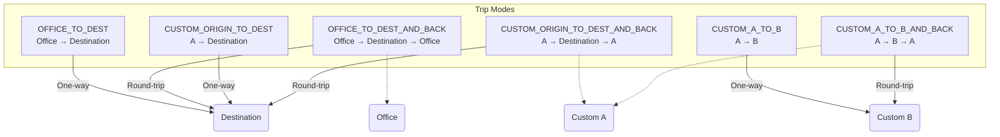

🧩 Objective

Implement a hybrid location and mileage calculation system that allows:
	•	Admin-controlled destinations (with coordinates)
	•	User-defined custom destinations
	•	Trip types (one-way, round-trip, custom)
	•	Accurate mileage calculation using Google Maps Directions API

⸻

📚 Sections

1. Trip Mode Architecture

Users can select one of several trip modes that determine the mileage calculation behavior:



Interface Enum:

```typescript
enum TripMode {
  OFFICE_TO_DEST = 'OFFICE_TO_DEST',
  OFFICE_TO_DEST_AND_BACK = 'OFFICE_TO_DEST_AND_BACK',
  CUSTOM_ORIGIN_TO_DEST = 'CUSTOM_ORIGIN_TO_DEST',
  CUSTOM_ORIGIN_TO_DEST_AND_BACK = 'CUSTOM_ORIGIN_TO_DEST_AND_BACK',
  CUSTOM_A_TO_B = 'CUSTOM_A_TO_B',
  CUSTOM_A_TO_B_AND_BACK = 'CUSTOM_A_TO_B_AND_BACK',
}   
```

⸻

2. Admin-Controlled LocationTemplate Model

MongoDB schema:

const LocationTemplateSchema = new Schema({
  name: { type: String, required: true }, // e.g., "KPKT"
  address: { type: String, required: true },
  lat: { type: Number, required: true },
  lng: { type: Number, required: true }
});

API Routes:
	•	GET /api/location-templates
	•	POST /api/location-templates
	•	PATCH /api/location-templates/:id
	•	DELETE /api/location-templates/:id

⸻

3. Office Location Configuration

System office location (used as default origin):

interface OfficeLocation {
  lat: number;
  lng: number;
  name: string;
}

Can be stored in a .env file or a MongoDB config document:

OFFICE_LAT=3.139
OFFICE_LNG=101.6869
OFFICE_NAME=Main HQ

Or editable from an admin config panel.

⸻

4. Google Maps Integration

Util: getDistanceInKM

async function getDistanceInKM(origin: string, destination: string): Promise<number> {
  const response = await fetch(`https://maps.googleapis.com/maps/api/directions/json?origin=${encodeURIComponent(origin)}&destination=${encodeURIComponent(destination)}&key=${process.env.GOOGLE_MAPS_API_KEY}`);
  const data = await response.json();
  if (data.status !== 'OK') throw new Error('Google Maps Error');
  return data.routes[0].legs[0].distance.value / 1000;
}

✅ Can accept both string addresses or lat,lng format.

⸻

5. Form Integration

The /submit/expense page should:
	•	Load LocationTemplate options into a `<Select>` dropdown
	•	Allow user to choose:
	•	Trip Mode
	•	Destination (template or custom)
	•	Origin (if TripMode allows custom origin)
	•	Automatically calculate mileage using selected TripMode
	•	Set calculated mileage field as readOnly (manual override not allowed)

⸻

6. Mileage Calculation Logic

function calculateMileage(tripMode: TripMode, office: LatLng, origin: LatLng, destination: LatLng): Promise<number> {
  switch (tripMode) {
    case TripMode.OFFICE_TO_DEST:
      return getDistanceInKM(office, destination);
    case TripMode.OFFICE_TO_DEST_AND_BACK:
      return getDistanceInKM(office, destination).then(km => km * 2);
    case TripMode.CUSTOM_A_TO_B:
      return getDistanceInKM(origin, destination);
    case TripMode.CUSTOM_A_TO_B_AND_BACK:
      return getDistanceInKM(origin, destination).then(km => km * 2);
    default:
      throw new Error('Unsupported TripMode');
  }
}


⸻

7. UX Behaviors
	•	Trip mode dynamically controls which fields are editable:
	•	If OFFICE mode → origin is locked
	•	If CUSTOM mode → allow freeform or autocomplete inputs
	•	Inline feedback:
🚗 “Estimated distance: 15.6 km (via Google Maps)”
	•	Mileage field should:
	•	Autofill from calculation
	•	Be non-editable unless policy allows override

⸻

8. Optional Enhancements

Feature	Status
Save custom A→B as route template	Future
Integrate toll estimation	Future
Validate route policy (e.g. staff can’t travel > 50km)	Future


⸻

9. Validation Rules

• Mileage field must be read-only for staff users and auto-filled from calculation.
• If TripMode is selected, corresponding fields must be filled:
  - OFFICE modes require destination only.
  - CUSTOM modes require origin and destination.
• Mileage exceeding 100km should trigger a soft warning message.
• Admins may override mileage or validation via role-based logic.
• Required fields must be validated by the frontend using react-hook-form and Zod schema.

⸻

10. Optional Model: SavedTripTemplate (Per User)

Allows users to save frequently used A→B or round-trip routes for future reuse.

Schema:
```ts
interface SavedTripTemplate {
  userId: ObjectId;
  origin: {
    name: string;
    lat: number;
    lng: number;
  };
  destination: {
    name: string;
    lat: number;
    lng: number;
  };
  roundTrip: boolean;
  label: string;
  createdAt: Date;
}
```

API Routes:
- GET /api/saved-trip-templates
- POST /api/saved-trip-templates
- DELETE /api/saved-trip-templates/:id

Integration:
- Add dropdown in expense form to “Load Saved Trip”
- Allow saving current trip config as template with a name

⸻

11. Form Behavior Matrix

| Field        | Visible | Editable | Depends On                 |
|--------------|---------|----------|----------------------------|
| TripMode     | ✅       | ✅        | Always                     |
| Origin       | ✅       | ✅        | Required in CUSTOM modes   |
| Destination  | ✅       | ✅        | Always                     |
| Mileage      | ✅       | ❌        | Auto-filled from GMap API  |
| Remarks      | ✅       | ✅        | Always                     |
| Save as Template | ✅   | ✅        | When both origin & dest are filled |
| Warning Banner (km > 100) | ✅   | —        | Triggered by distance calc |

🛰️ AI Agent Spec: Finalized Location & Mileage System

📦 Output Expectations for AI Agent

The agent should:
	•	Implement the LocationTemplate model and API routes
	•	Scaffold admin management page for locations
	•	Integrate TripMode system in expense form
	•	Add getDistanceInKM() utility using GMap API
	•	Wire UI events to auto-calculate mileage
	•	Confirm mileage reflects real-world estimates accurately

⸻
