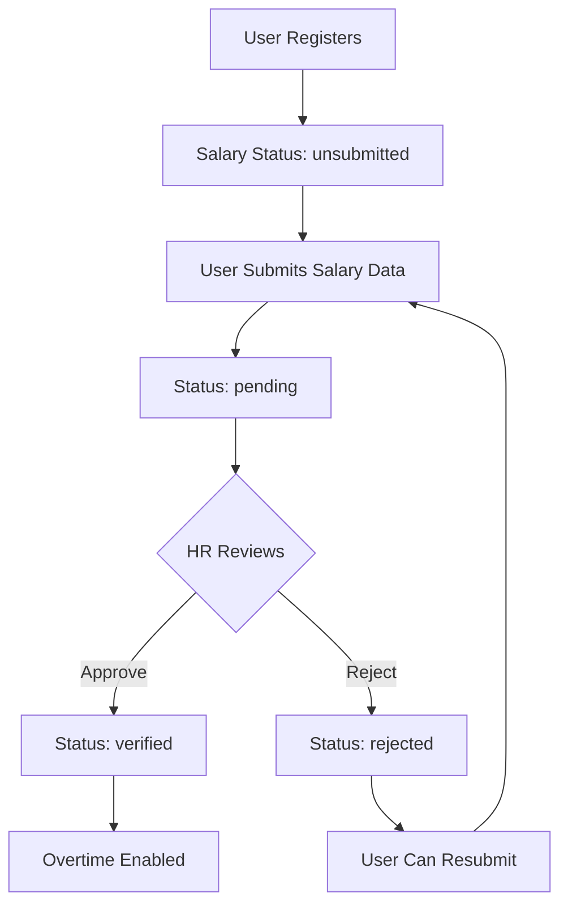
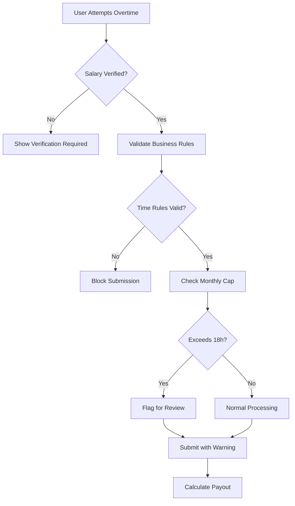

# ClaimBot Salary Verification & Overtime System Architecture

## Executive Summary

This architectural design extends ClaimBot's existing Next.js 15 + TypeScript system to include a salary verification workflow that gates overtime submissions. The design introduces a new HR role, salary verification states, enhanced overtime business rules, and maintains backwards compatibility with the existing Clerk auth and RBAC system.

## 1. Database Schema Changes

### 1.1 User Model Extensions

```typescript
// src/models/User.ts - Enhanced User Schema
export interface IUser extends Document {
  // Existing fields...
  clerkId: string;
  name?: string;
  email: string;
  department?: string;
  designation?: string;
  roles: UserRole[]; // Now includes 'hr'
  isActive: boolean;
  
  // Enhanced salary fields
  salary?: number; // Monthly salary (existing)
  hourlyRate?: number; // Auto-calculated from salary (existing)
  
  // NEW: Salary verification fields
  salaryVerification: {
    status: 'unsubmitted' | 'pending' | 'verified' | 'rejected';
    submittedSalary?: number; // User-submitted salary
    submittedAt?: Date;
    verifiedBy?: Types.ObjectId; // HR user who verified
    verifiedAt?: Date;
    rejectionReason?: string;
    lastUpdated: Date;
  };
  
  // NEW: Overtime eligibility
  overtimeEligible: boolean; // Computed field based on salary verification
  
  createdAt: Date;
  updatedAt: Date;
}
```

### 1.2 New UserRole Type

```typescript
// Update UserRole to include HR
export type UserRole = 'staff' | 'manager' | 'finance' | 'admin' | 'hr' | 'superadmin';
```

### 1.3 Overtime Model Enhancements

```typescript
// src/models/Overtime.ts - Enhanced with validation tracking
export interface IOvertime extends Document {
  // Existing fields...
  userId: Types.ObjectId;
  date: Date;
  startTime: string;
  endTime: string;
  reason: string;
  hoursWorked?: number;
  
  // NEW: Business rule validation
  validationFlags: {
    exceedsMonthlyLimit: boolean;
    monthlyHoursUsed: number; // Hours used in current month
    isWeekendWork: boolean;
    isAfter8PM: boolean; // For weekday validation
  };
  
  // Enhanced calculation fields
  rateMultiplier?: number;
  hourlyRate?: number;
  totalPayout?: number;
  
  attachments: Types.ObjectId[];
  status: 'submitted' | 'approved' | 'rejected' | 'paid';
  approvedBy?: Types.ObjectId;
  approvedAt?: Date;
  remarks?: string;
  createdAt: Date;
  updatedAt: Date;
}
```

## 2. API Endpoint Specifications

### 2.1 Salary Management Endpoints

```typescript
// src/app/api/salary/route.ts
// GET /api/salary - Get current user's salary verification status
// POST /api/salary - Submit salary for verification
// PATCH /api/salary - Update submitted salary (if pending)

// src/app/api/salary/verify/route.ts  
// POST /api/salary/verify - HR verifies/rejects salary (HR + Superadmin only)
// GET /api/salary/verify - Get pending salary verifications (HR + Superadmin only)
```

### 2.2 Enhanced Overtime Endpoints

```typescript
// src/app/api/overtime/route.ts - Enhanced with salary verification check
// GET /api/overtime - Include salary verification status in response
// POST /api/overtime - Validate salary verification + business rules

// src/app/api/overtime/validate/route.ts
// POST /api/overtime/validate - Pre-validate overtime submission rules
```

### 2.3 Configuration Endpoints

```typescript
// src/app/api/config/overtime-rules/route.ts
// GET /api/config/overtime-rules - Get overtime business rules
// POST /api/config/overtime-rules - Update overtime rules (Admin + Superadmin)
```

## 3. Frontend Component Architecture

### 3.1 Salary Verification Flow Components

```
src/components/salary/
├── SalaryVerificationCard.tsx      # Dashboard status card
├── SalarySubmissionForm.tsx        # User salary submission
├── SalaryVerificationList.tsx      # HR pending verifications
├── SalaryStatusBadge.tsx          # Status indicator component
└── SalaryVerificationModal.tsx     # HR verification modal
```

### 3.2 Enhanced Overtime Components

```
src/components/overtime/
├── OvertimeEligibilityCheck.tsx    # Salary verification gate
├── OvertimeRulesValidator.tsx      # Business rules validation
├── OvertimeSubmissionForm.tsx      # Enhanced form with validation
└── OvertimeCapIndicator.tsx        # Monthly cap progress indicator
```

### 3.3 Dashboard Integration

```typescript
// Enhanced Dashboard with salary verification status
const DashboardPage = () => {
  // Show salary verification card if not verified
  // Disable/enable overtime button based on verification status
  // Display overtime cap usage
};
```

## 4. Data Flow Architecture

### 4.1 Salary Verification Flow



### 4.2 Overtime Submission Flow



## 5. Business Rules Implementation

### 5.1 Overtime Validation Logic

```typescript
// src/lib/overtime-validator.ts
export class OvertimeValidator {
  // Hard validation (blocks submission)
  static validateTimeRestrictions(date: Date, startTime: string): ValidationResult {
    const dayOfWeek = date.getDay();
    const isWeekend = dayOfWeek === 0 || dayOfWeek === 6;
    
    if (!isWeekend) {
      const startHour = parseInt(startTime.split(':')[0]);
      if (startHour < 20) { // Before 8 PM
        return { valid: false, reason: 'Weekday overtime must start after 8 PM' };
      }
    }
    
    return { valid: true };
  }
  
  // Soft validation (allows submission with warning)
  static async validateMonthlyLimit(userId: string, date: Date, hoursWorked: number): Promise<ValidationResult> {
    const monthlyHours = await this.getMonthlyOvertimeHours(userId, date);
    const totalHours = monthlyHours + hoursWorked;
    
    return {
      valid: true,
      warning: totalHours > 18 ? `Exceeds monthly limit (${totalHours}/18 hours)` : undefined,
      exceedsLimit: totalHours > 18,
      monthlyHoursUsed: monthlyHours
    };
  }
}
```

### 5.2 Salary Verification Logic

```typescript
// src/lib/salary-calculator.ts
export class SalaryCalculator {
  static calculateHourlyRate(monthlySalary: number): number {
    // Assuming 22 working days, 8 hours per day
    return monthlySalary / (22 * 8);
  }
  
  static calculateOvertimePayout(hourlyRate: number, hours: number, isWeekend: boolean): number {
    const multiplier = isWeekend ? 1.5 : 1.0;
    return hourlyRate * hours * multiplier;
  }
}
```

## 6. RBAC Integration

### 6.1 Enhanced Role Permissions

```typescript
// src/lib/rbac.ts - Updated permissions
export const ROLE_PERMISSIONS = {
  // ... existing permissions
  hr: [
    'salary:verify',
    'salary:read:all',
    'users:read:salary',
    'overtime:read:all',
    'reports:read:hr'
  ],
  // ... other roles
};

// New permission checks
export const SALARY_PERMISSIONS = {
  SUBMIT_SALARY: 'salary:submit',
  VERIFY_SALARY: 'salary:verify',
  READ_ALL_SALARIES: 'salary:read:all'
};
```

### 6.2 Route Protection Updates

```typescript
// Add HR routes to protected routes
export const PROTECTED_ROUTES: RouteConfig[] = [
  // ... existing routes
  {
    path: '/hr',
    requiredRoles: ['hr', 'superadmin'],
    requiredPermissions: ['salary:verify'],
    allowHierarchy: true
  },
  {
    path: '/api/salary/verify',
    requiredRoles: ['hr', 'superadmin'],
    requiredPermissions: ['salary:verify'],
    isApiRoute: true,
    allowHierarchy: true
  }
];
```

## 7. User Experience Flow

### 7.1 New User Onboarding

1. **Registration**: User registers via Clerk
2. **Profile Setup**: User completes basic profile
3. **Salary Submission**: System prompts for salary data
4. **Verification Wait**: User sees pending status
5. **Notification**: User notified when verified/rejected
6. **Overtime Access**: Overtime features unlocked

### 7.2 Overtime Submission UX

```typescript
// Enhanced overtime button states
const OvertimeButton = () => {
  const { salaryVerified, monthlyHours } = useSalaryStatus();
  
  if (!salaryVerified) {
    return (
      <Button disabled className="bg-gray-400">
        🔒 Salary Verification Required
      </Button>
    );
  }
  
  return (
    <Button className="bg-green-600 hover:bg-green-700">
      ✅ Submit Overtime ({monthlyHours}/18h used)
    </Button>
  );
};
```

## 8. Integration Points

### 8.1 Dashboard Integration

- **Salary Verification Card**: Shows current status and next steps
- **Overtime Button State**: Visual indication of eligibility
- **Monthly Cap Indicator**: Progress bar showing overtime usage
- **Quick Actions**: Direct links to salary submission/overtime forms

### 8.2 Admin Panel Integration

- **HR Dashboard**: New section for salary verifications
- **User Management**: Enhanced with salary verification status
- **Overtime Reports**: Include monthly cap violations
- **System Configuration**: Overtime rules management

### 8.3 Notification System

- **Email Notifications**: Salary verification status changes
- **In-App Alerts**: Overtime cap warnings
- **Dashboard Badges**: Pending action indicators

## 9. Migration Strategy

### 9.1 Database Migration

```typescript
// scripts/migrations/addSalaryVerification.ts
export async function migrateSalaryVerification() {
  // Add salaryVerification field to existing users
  await User.updateMany(
    { salaryVerification: { $exists: false } },
    {
      $set: {
        salaryVerification: {
          status: 'unsubmitted',
          lastUpdated: new Date()
        },
        overtimeEligible: false
      }
    }
  );
}
```

### 9.2 Backwards Compatibility

- Existing overtime submissions remain valid
- Users with existing salary data auto-marked as verified
- Gradual rollout with feature flags
- Legacy API endpoints maintained during transition

## 10. Technical Implementation Plan

### Phase 1: Core Infrastructure
1. Update User model with salary verification fields
2. Add HR role to RBAC system
3. Create salary management API endpoints
4. Implement basic salary verification workflow

### Phase 2: Overtime Enhancement
1. Enhance Overtime model with validation flags
2. Implement business rules validation
3. Update overtime API with salary checks
4. Create overtime validation utilities

### Phase 3: Frontend Integration
1. Build salary verification components
2. Enhance overtime submission form
3. Update dashboard with new features
4. Create HR management interface

### Phase 4: Testing & Deployment
1. Comprehensive testing of all workflows
2. Migration script testing
3. User acceptance testing
4. Gradual production rollout

## 11. Key Design Decisions

### 11.1 Salary Verification Approach
- **User-initiated**: Users submit their own salary data for verification
- **HR-gated**: Only HR and Superadmin can verify salary data
- **Monthly salary only**: System auto-calculates hourly rate from monthly salary
- **Resubmission allowed**: Users can resubmit if rejected

### 11.2 Overtime Business Rules
- **Hard time restrictions**: Block submissions before 8 PM on weekdays
- **Soft monthly cap**: Allow submissions over 18 hours but flag for review
- **Weekend multiplier**: 1.5x rate for weekend work, 1x for weekdays
- **Auto-calculation**: System calculates payout based on verified salary

### 11.3 Integration Strategy
- **Backwards compatible**: Existing data and workflows preserved
- **Gradual rollout**: Feature flags for controlled deployment
- **Role-based access**: Leverages existing RBAC system
- **API-first**: All functionality exposed via REST APIs

## 12. Security Considerations

### 12.1 Data Protection
- Salary data encrypted at rest
- Access logging for all salary operations
- Role-based data filtering in API responses
- Audit trail for all verification actions

### 12.2 Authorization
- Multi-level permission checks
- API endpoint protection
- Frontend component guards
- Route-level access control

## 13. Performance Considerations

### 13.1 Database Optimization
- Indexed queries for salary verification status
- Efficient monthly overtime calculations
- Cached hourly rate calculations
- Optimized user lookup patterns

### 13.2 Frontend Performance
- Lazy loading of salary components
- Cached verification status
- Optimistic UI updates
- Progressive enhancement

This architecture provides a comprehensive solution that integrates salary verification with the overtime system while maintaining the existing ClaimBot structure and ensuring a smooth user experience. The design is scalable, maintainable, and follows the established patterns in the codebase.