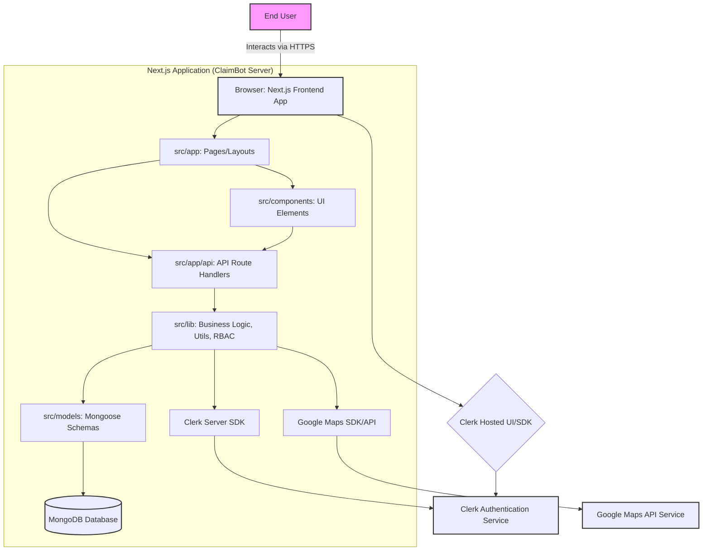
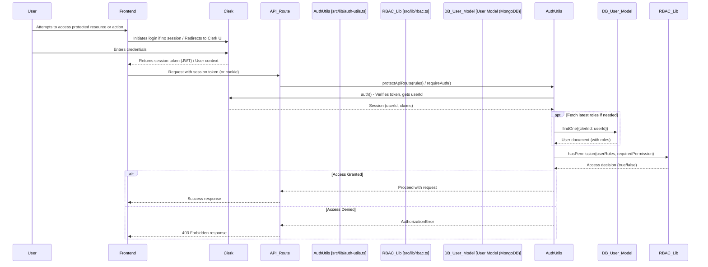

---

**ClaimBot: Overall Architecture Document**

**1. Introduction**

ClaimBot is a Next.js 15 and TypeScript-based expense and overtime management system. It utilizes MongoDB with Mongoose as its ODM, Clerk for authentication, and a custom Role-Based Access Control (RBAC) system for authorization. This document provides a high-level overview of its architecture.

**2. Core Technologies & Architectural Style**

*   **Frontend:** Next.js 15 (App Router), React, TypeScript, Tailwind CSS.
*   **Backend:** Next.js API Routes (Node.js runtime), TypeScript.
*   **Database:** MongoDB with Mongoose ODM.
*   **Authentication:** Clerk.
*   **Authorization:** Custom RBAC system ([`src/lib/rbac.ts`](src/lib/rbac.ts:1)).
*   **Architectural Pattern:** Monolithic frontend and backend within the Next.js framework, leveraging server components and serverless functions (API routes).

**3. System Components Overview**

The system can be broken down into the following major components:

*   **Next.js Application (`src/`)**
    *   **App Router (`src/app/`)**: Manages UI pages, layouts, and routing.
        *   **Pages & Layouts**: Defines the user interface for different sections (e.g., dashboard, admin panel, submission forms).
        *   **API Routes (`src/app/api/`)**: Provides the backend RESTful API endpoints for frontend interactions and business logic execution.
    *   **Components (`src/components/`)**: Contains reusable UI elements, including:
        *   **UI Primitives (`ui/`)**: Basic building blocks (buttons, cards, inputs) likely based on Shadcn/UI.
        *   **Application-Specific Components**: More complex components tailored to ClaimBot's features (e.g., `DataTable`, `SalarySubmissionForm`, `LocationAutocomplete`).
    *   **Libraries/Utilities (`src/lib/`)**: Houses core business logic, utility functions, external service integrations, and the RBAC system.
        *   **Authentication Utilities (`auth-utils.ts`)**: Integrates Clerk with the custom RBAC.
        *   **RBAC Logic (`rbac.ts`)**: Defines roles, permissions, and access control rules.
        *   **Database Utilities (`server/db.ts`)**: Manages MongoDB connection.
        *   **Service Integrations**: Modules for Google Maps, potentially others.
    *   **Models (`src/models/`)**: Defines Mongoose schemas for database collections (User, Claim, Overtime, RateConfig, etc.).
*   **Clerk**: External service for user authentication (sign-up, sign-in, session management). User roles are synced to Clerk's public metadata.
*   **MongoDB**: NoSQL database storing all application data.
*   **Google Maps API**: External service used for location-based services (autocomplete, mileage calculation).

**4. High-Level Architecture Diagram**

**5. Key Data Flows**

*   **User Authentication:**
    1.  User navigates to login/register page.
    2.  Frontend redirects/uses Clerk's hosted UI or SDK.
    3.  User authenticates with Clerk.
    4.  Clerk issues a session token (JWT).
    5.  Frontend stores the token and uses it for subsequent API requests.
    6.  API Routes validate the token using Clerk Server SDK. User roles from Clerk's public metadata are used by the RBAC system.
*   **Data Submission (e.g., New Claim):**
    1.  User fills out a form in a frontend page (e.g., [`SubmitExpensePage`](src/app/submit/expense/page.tsx:1)).
    2.  Client-side validation (Zod) occurs.
    3.  On submit, the frontend page makes a `POST` request to the relevant API Route (e.g., [`/api/claims`](src/app/api/claims/route.ts:1)).
    4.  The API Route authenticates the user (Clerk) and authorizes (RBAC).
    5.  Server-side validation (Zod) of the request body.
    6.  Business logic is executed (e.g., calculating total claim amount, interacting with `src/lib/` utilities).
    7.  Data is saved to MongoDB via Mongoose Models.
    8.  An audit log entry may be created.
    9.  API Route returns a response to the frontend.
*   **Data Fetching (e.g., Viewing Dashboard):**
    1.  User navigates to a page (e.g., [`DashboardPage`](src/app/dashboard/page.tsx:1)).
    2.  The page component (often in `useEffect`) makes `GET` requests to one or more API Routes (e.g., `/api/claims`, `/api/overtime`).
    3.  API Routes authenticate/authorize, fetch data from MongoDB via Models, perform any necessary transformations, and return data.
    4.  Frontend page receives data and updates the UI.
*   **Admin Operations (e.g., User Management):**
    1.  Admin user navigates to an admin page (e.g., [`/admin/users`](src/app/admin/users/page.tsx)).
    2.  Page access is controlled by RBAC (via `PROTECTED_ROUTES` and potentially client-side checks using `useRBAC`).
    3.  Admin performs an action (e.g., updating a user's role).
    4.  Frontend makes an API request (e.g., `PATCH /api/admin/users/{userId}/roles`).
    5.  API Route verifies admin's permissions (RBAC).
    6.  Action is performed (e.g., update User model, sync roles to Clerk).
    7.  Response is sent back.

**6. Authentication and Authorization Flow**

**7. Key Architectural Decisions & Considerations**

*   **Next.js App Router:** Provides server-side rendering, client-side navigation, API route co-location, and a modern React development experience.
*   **Clerk for Authentication:** Offloads complex user management and authentication security to a specialized service.
*   **Custom RBAC:** Offers fine-grained control over permissions tailored to ClaimBot's specific needs. The definition of roles and permissions in [`src/lib/rbac.ts`](src/lib/rbac.ts:1) is central.
*   **Mongoose ODM:** Provides a schema-based solution for MongoDB, simplifying database interactions.
*   **Serverless Functions (API Routes):** Scalable and cost-effective for backend logic.
*   **TypeScript:** Enhances code quality, maintainability, and developer experience through static typing.

---