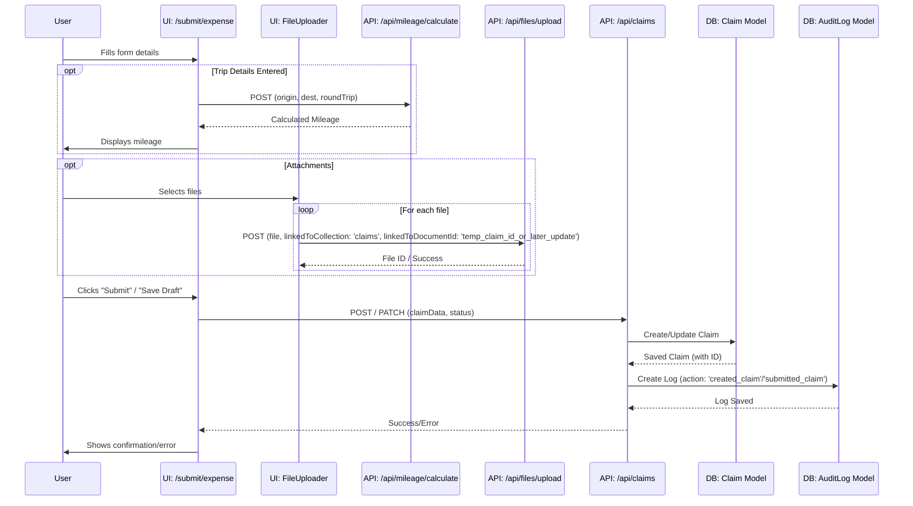
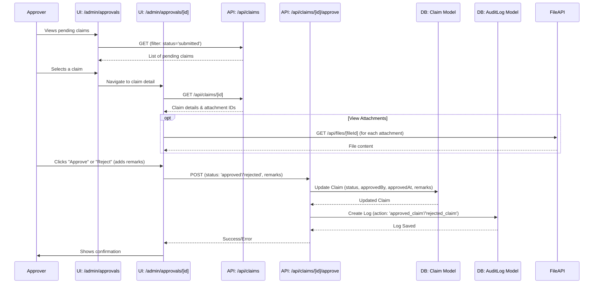

---

**ClaimBot Workflows: Claim Submission & Approval**

**1. Overview**

This document outlines the end-to-end workflow for submitting an expense claim, having it reviewed, and processed for approval or rejection within the ClaimBot system.

**2. Actors**

*   **Submitter (Staff/User):** Any authenticated user with the permission to create claims (typically 'staff' role and above).
*   **Approver (Manager/Finance/Admin):** Users with roles and permissions to review and approve/reject claims (e.g., 'manager', 'finance', 'admin').

**3. Workflow Steps & Diagrams**

**3.1. Claim Creation and Submission (by Submitter)**

1.  **Navigate to Submit Expense Page:**
    *   The user navigates to the "Submit Expense" page (e.g., [`/submit/expense`](src/app/submit/expense/page.tsx:1)).
2.  **Fill Claim Details:**
    *   The user fills in the expense claim form, providing details such as date, project (optional), description, trip information (origin, destination, round trip, trip mode), and itemized expenses (mileage, toll, petrol, meal, others).
    *   **UI:** [`SubmitExpensePage`](src/app/submit/expense/page.tsx:1) component.
    *   **Logic:**
        *   Uses `LocationAutocomplete` for origin/destination.
        *   Mileage is auto-calculated via `/api/mileage/calculate` if trip details are provided.
        *   User can select pre-defined trip templates (user-saved or admin-defined).
        *   User can save current trip details as a new template.
3.  **Upload Attachments (Optional):**
    *   User uploads supporting documents (receipts, etc.) via the `FileUploader` component.
    *   **API Call:** `POST /api/files/upload` for each file. The API links the uploaded file's ID to the claim document ID (once the claim is saved).
    *   **Model:** `File` metadata is created.
4.  **Save as Draft (Optional):**
    *   User can save the claim as a 'draft'.
    *   **API Call:** `POST /api/claims` with `status: 'draft'` (if new) or `PATCH /api/claims/[id]` (if editing existing draft).
    *   **Model:** `Claim` document is created/updated with `status: 'draft'`.
5.  **Submit Claim:**
    *   User finalizes the claim and clicks "Submit".
    *   **API Call:**
        *   If new: `POST /api/claims` with relevant claim data and `status: 'submitted'`.
        *   If editing draft: `PATCH /api/claims/[id]` to update fields and set `status: 'submitted'`.
    *   **Model:** `Claim` document is created/updated. `status` becomes 'submitted', `submittedAt` is set.
    *   **Audit:** An `AuditLog` entry is created for claim submission.

**Sequence Diagram: Claim Creation & Submission**

**3.2. Claim Approval/Rejection (by Approver)**

1.  **Navigate to Approvals Page:**
    *   The Approver (Manager, Finance, Admin) navigates to an approvals dashboard or a list of pending claims (e.g., [`/admin/approvals`](src/app/admin/approvals/page.tsx) or a similar admin page).
    *   **UI:** Admin page listing pending submissions, likely using `DataTable` or `PendingSubmissionsList`.
    *   **API Call (for list):** `GET /api/claims` (with filters for 'submitted' status and possibly team/department if applicable for Managers).
2.  **Select Claim for Review:**
    *   Approver selects a specific claim to review its details.
    *   **UI:** Navigates to a claim detail view (e.g., [`/admin/approvals/[id]`](src/app/admin/approvals/[id]/page.tsx)).
    *   **API Call (for detail):** `GET /api/claims/[id]`.
3.  **Review Claim Details & Attachments:**
    *   Approver examines all claim information, including itemized expenses and any uploaded attachments.
    *   **API Call (for attachments):** `GET /api/files/[fileId]` for each attachment.
4.  **Approve or Reject:**
    *   Approver makes a decision.
    *   **UI:** Buttons for "Approve" / "Reject", possibly a field for remarks.
    *   **API Call:** `POST /api/claims/[id]/approve` with `status: 'approved'` or `status: 'rejected'` and optional `remarks`.
    *   **Model:** `Claim` document is updated: `status` changes, `approvedBy` (Approver's User ID), `approvedAt` (timestamp), and `remarks` are set.
    *   **Audit:** An `AuditLog` entry is created for the approval/rejection action.
5.  **Notification (Implicit):**
    *   The Submitter might be notified of the status change (e.g., via email, or by checking "My Submissions"). The system currently doesn't show explicit notification mechanisms in the analyzed code, but this is a typical feature.

**Sequence Diagram: Claim Approval/Rejection**

**4. Data Models Involved**

*   **[`Claim`](src/models/Claim.ts:1):** Central model for storing all claim data and its lifecycle status.
*   **[`User`](src/models/User.ts:1):** Stores Submitter and Approver information. User roles determine permissions.
*   **[`File`](src/models/File.ts:1):** Stores metadata for uploaded attachments linked to claims.
*   **[`AuditLog`](src/models/AuditLog.ts:1):** Records actions like claim creation, submission, approval, and rejection.
*   **[`RateConfig`](src/models/RateConfig.ts:1):** (Indirectly) Used by the backend when calculating `totalClaim` if mileage rates are configured and fetched (currently hardcoded in some API snippets with a TODO).

**5. Key RBAC Permissions Involved**

*   **Submitter:**
    *   `claims:create`
    *   `claims:update:own` (for drafts)
    *   `files:upload`
*   **Approver:**
    *   `claims:approve` (core permission for this workflow)
    *   `claims:read:team` or `claims:read:all` (to view claims for approval)
    *   `files:read:own` (or broader, to view attachments on claims they can see)

---