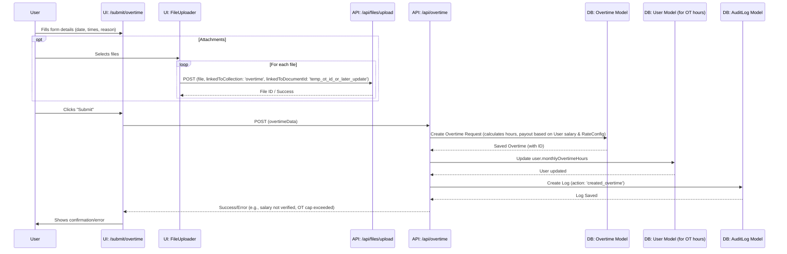
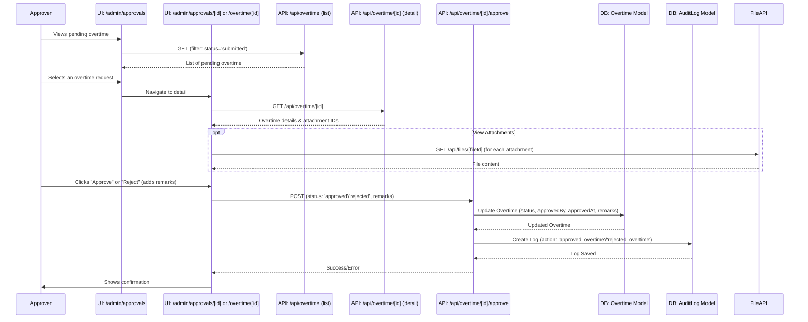

---

**ClaimBot Workflows: Overtime Submission & Approval**

**1. Overview**

This document outlines the end-to-end workflow for submitting an overtime request, having it reviewed, and processed for approval or rejection within the ClaimBot system.

**2. Actors**

*   **Submitter (Staff/User):** Any authenticated user with the permission to create overtime requests (typically 'staff' role and above) and whose salary is verified.
*   **Approver (Manager/Finance/Admin):** Users with roles and permissions to review and approve/reject overtime requests (e.g., 'manager', 'finance', 'admin').

**3. Workflow Steps & Diagrams**

**3.1. Overtime Request Creation and Submission (by Submitter)**

1.  **Navigate to Submit Overtime Page:**
    *   The user navigates to the "Submit Overtime" page (e.g., [`/submit/overtime`](src/app/submit/overtime/page.tsx:1)).
2.  **Fill Overtime Details:**
    *   The user fills in the overtime request form, providing details such as date, start time, end time, and reason/justification for the overtime.
    *   **UI:** [`SubmitOvertimePage`](src/app/submit/overtime/page.tsx:1) component (structure inferred).
    *   **Logic:**
        *   Client-side validation for time formats, reason, and potentially business rules (e.g., weekday overtime start time).
        *   User's salary must be in 'verified' status (checked by the backend API).
3.  **Upload Attachments (Optional):**
    *   User uploads supporting documents if required (e.g., approval email, work logs) via a `FileUploader` component.
    *   **API Call:** `POST /api/files/upload` for each file, linking to the overtime document ID.
    *   **Model:** `File` metadata is created.
4.  **Submit Overtime Request:**
    *   User finalizes the request and clicks "Submit".
    *   **API Call:** `POST /api/overtime` with overtime details.
    *   **Model:** `Overtime` document is created. `status` is set to 'submitted'. Fields like `hoursWorked`, `rateMultiplier`, `hourlyRate`, and `totalPayout` are calculated by the backend based on user's verified salary, `RateConfig`, and overtime duration. User's `monthlyOvertimeHours` in the `User` model is updated.
    *   **Audit:** An `AuditLog` entry is created for overtime submission.
    *   **Validation:** Backend validates against monthly OT cap (18 hours) and weekday start time rules.

**Sequence Diagram: Overtime Creation & Submission**

**3.2. Overtime Approval/Rejection (by Approver)**

1.  **Navigate to Approvals Page:**
    *   The Approver navigates to an approvals dashboard (e.g., [`/admin/approvals`](src/app/admin/approvals/page.tsx)).
    *   **UI:** Admin page listing pending submissions.
    *   **API Call (for list):** `GET /api/overtime` (with filters for 'submitted' status).
2.  **Select Overtime Request for Review:**
    *   Approver selects a specific overtime request.
    *   **UI:** Navigates to an overtime detail view (e.g., [`/admin/approvals/[id]` or `/overtime/[id]`](src/app/overtime/[id]/page.tsx) if it shows admin actions).
    *   **API Call (for detail):** `GET /api/overtime/[id]`.
3.  **Review Overtime Details & Attachments:**
    *   Approver examines all request information.
    *   **API Call (for attachments):** `GET /api/files/[fileId]`.
4.  **Approve or Reject:**
    *   Approver makes a decision.
    *   **UI:** Buttons for "Approve" / "Reject", remarks field.
    *   **API Call:** `POST /api/overtime/[id]/approve` with `status: 'approved'` or `status: 'rejected'` and optional `remarks`.
    *   **Model:** `Overtime` document is updated: `status` changes, `approvedBy`, `approvedAt`, and `remarks` are set.
    *   **Audit:** An `AuditLog` entry is created.
5.  **Notification (Implicit):**
    *   Submitter may be notified of the status change.

**Sequence Diagram: Overtime Approval/Rejection**

**4. Data Models Involved**

*   **[`Overtime`](src/models/Overtime.ts:1):** Central model for storing overtime request data and its lifecycle.
*   **[`User`](src/models/User.ts:1):** Stores Submitter and Approver information. User roles, `salaryVerificationStatus`, `monthlySalary`/`hourlyRate`, `designation`, and `monthlyOvertimeHours` are critical.
*   **[`File`](src/models/File.ts:1):** Stores metadata for attachments.
*   **[`AuditLog`](src/models/AuditLog.ts:1):** Records actions related to overtime requests.
*   **[`RateConfig`](src/models/RateConfig.ts:1):** Used by the backend to determine the `rateMultiplier` for overtime payout calculations based on day type and user designation.

**5. Key RBAC Permissions Involved**

*   **Submitter:**
    *   `overtime:create`
    *   `overtime:update:own` (for drafts, if applicable, though current flow is direct submission)
    *   `files:upload`
*   **Approver:**
    *   `overtime:approve`
    *   `overtime:read:team` or `overtime:read:all`

---