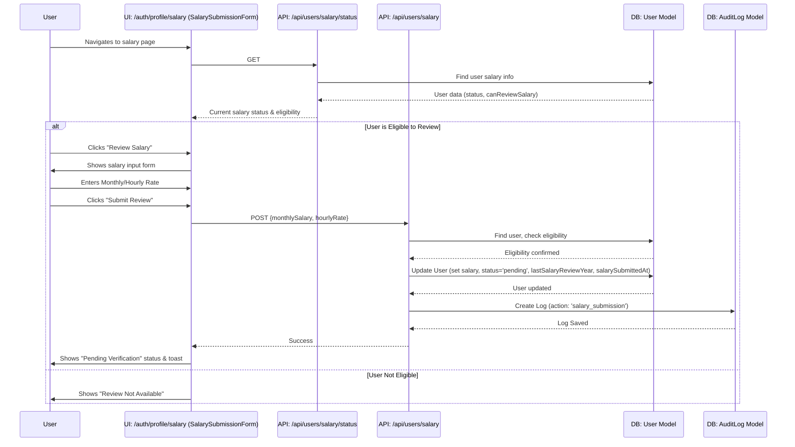
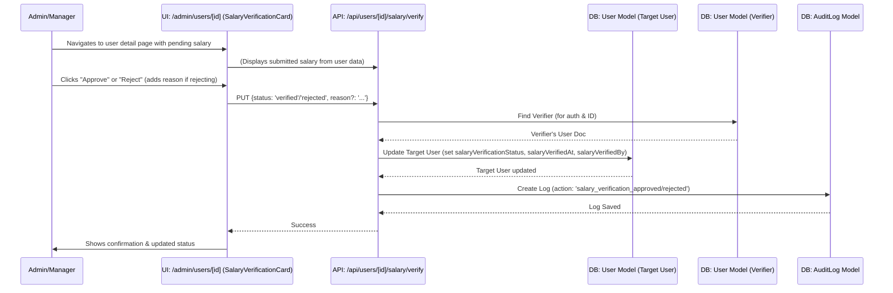

---

**ClaimBot Workflows: Salary Submission & Verification**

**1. Overview**

This document outlines the workflow for users to submit their salary information for verification and for administrators/managers to review and verify these submissions. Verified salary information is crucial for accurate overtime calculations.

**2. Actors**

*   **User (Staff):** Any authenticated user who needs to submit their salary details.
*   **Verifier (Manager/Admin/Superadmin):** Users with permissions to view and verify/reject salary submissions.

**3. Workflow Steps & Diagrams**

**3.1. User Submits Salary Information**

1.  **Navigate to Salary Submission Page/Section:**
    *   The user navigates to their profile's salary section (e.g., [`/auth/profile/salary`](src/app/auth/profile/salary/page.tsx)) where the [`SalarySubmissionForm`](src/components/SalarySubmissionForm.tsx:53) component is rendered.
2.  **View Current Salary Status:**
    *   The [`SalarySubmissionForm`](src/components/SalarySubmissionForm.tsx:53) component first fetches the user's current salary status.
    *   **API Call:** `GET /api/users/salary/status`
    *   **Logic:** The API returns current salary details (`monthlySalary`, `hourlyRate`), verification status (`salaryVerificationStatus`), `lastSalaryReviewYear`, and `canReviewSalary` eligibility.
    *   **UI:** Displays status (e.g., "Salary Review Required", "Pending Verification", "Salary Reviewed This Year", "Annual Salary Review Available").
3.  **Initiate Salary Review (if eligible):**
    *   If `canReviewSalary` is true (typically once per year, or if previously rejected/not submitted), the user can click a "Review Salary" button.
    *   **UI:** The form for submitting salary details becomes visible.
4.  **Enter Salary Details:**
    *   User enters their `monthlySalary` OR `hourlyRate`.
    *   **UI:** Input fields within [`SalarySubmissionForm`](src/components/SalarySubmissionForm.tsx:53).
    *   **Validation (Client-side):** Zod schema (`salaryFormSchema` within the component) validates inputs (non-negative, at least one provided).
5.  **Submit Salary for Verification:**
    *   User clicks "Submit Review".
    *   **API Call:** `POST /api/users/salary` with `{ monthlySalary, hourlyRate }`.
    *   **Logic (Backend):**
        *   Verifies `canReviewSalary` again.
        *   Validates input using `SalarySubmissionSchema` from [`lib/validation/user.ts`](src/lib/validation/user.ts:1).
        *   Updates the `User` model: sets `monthlySalary`, `hourlyRate`, `salaryVerificationStatus` to 'pending', `salarySubmittedAt` to current date, and `lastSalaryReviewYear` to the current year. Unsets previous verification details.
        *   Uses direct MongoDB collection update (`User.collection.updateOne`) to prevent Mongoose caching issues.
    *   **Model:** `User` document is updated.
    *   **Audit:** An `AuditLog` entry is created for `salary_submission`.
    *   **UI:** Form hides, status updates to "Pending Verification". Toast notification shown.

**Sequence Diagram: User Salary Submission**

**3.2. Admin/Manager Verifies Salary Submission**

1.  **Identify Pending Verifications:**
    *   An Admin/Manager might see a count of pending verifications on their dashboard ([`AdminDashboard`](src/app/admin/page.tsx:35)).
    *   **API Call (for count):** `GET /api/admin/salary-verification/pending-count`.
    *   They navigate to a user management or salary verification section (e.g., [`/admin/users`](src/app/admin/users/page.tsx) or a dedicated `/admin/salary-verification` page).
2.  **View User with Pending Salary:**
    *   Admin/Manager selects a user whose `salaryVerificationStatus` is 'pending'. This might be from a list or directly on the user's detail page.
    *   **UI:** [`AdminUserDetailPage`](src/app/admin/users/[id]/page.tsx:1) displays user details and includes the [`SalaryVerificationCard`](src/components/admin/SalaryVerificationCard.tsx:1) if a request is pending.
    *   **API Call (user details):** `GET /api/users/[id]` (MongoDB ID).
3.  **Review Submitted Salary:**
    *   The [`SalaryVerificationCard`](src/components/admin/SalaryVerificationCard.tsx:1) (or similar UI) displays the `submittedMonthlySalary` and `submittedHourlyRate`.
4.  **Approve or Reject Salary:**
    *   Verifier makes a decision.
    *   **UI:** "Approve" / "Reject" buttons, possibly a remarks field.
    *   **API Call:** `PUT /api/users/[id]/salary/verify` (MongoDB ID of target user) with `{ status: 'verified' }` or `{ status: 'rejected', reason?: 'string' }`.
    *   **Logic (Backend):**
        *   Verifies that the authenticated user (Verifier) has 'manager', 'admin', or 'superadmin' role.
        *   Updates the target `User` model: sets `salaryVerificationStatus` to 'verified' or 'rejected', `salaryVerifiedAt` to current date, and `salaryVerifiedBy` to the Verifier's Clerk ID.
    *   **Model:** Target `User` document is updated.
    *   **Audit:** An `AuditLog` entry is created for `salary_verification_approved` or `salary_verification_rejected`.
    *   **UI:** Status on the admin page updates. Toast notification shown.

**Sequence Diagram: Salary Verification by Admin/Manager**

**4. Data Models Involved**

*   **[`User`](src/models/User.ts:1):** Central model. Stores `monthlySalary`, `hourlyRate`, `salaryVerificationStatus`, `salarySubmittedAt`, `salaryVerifiedAt`, `salaryVerifiedBy`, `lastSalaryReviewYear`, and the `canReviewSalary` virtual property.
*   **[`AuditLog`](src/models/AuditLog.ts:1):** Records `salary_submission` and `salary_verification_approved`/`rejected` actions.

**5. Key RBAC Permissions Involved**

*   **User (Submitter):**
    *   `salary:submit:own` (Implied by ability to call `POST /api/users/salary`)
    *   `profile:read:own` (To view their salary status via `GET /api/users/salary/status`)
*   **Verifier (Manager/Admin/Superadmin):**
    *   `salary:verify:team` or `salary:verify:all` (Permissions defined in [`rbac.ts`](src/lib/rbac.ts:1) that grant access to the verification action).
    *   `users:read:all` or `users:read:team` (To access user details and see pending verifications).

---