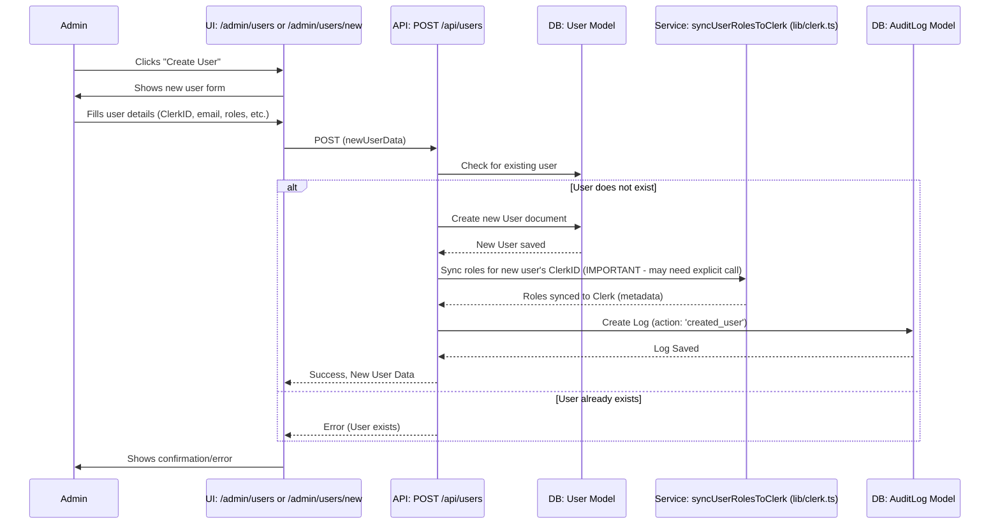
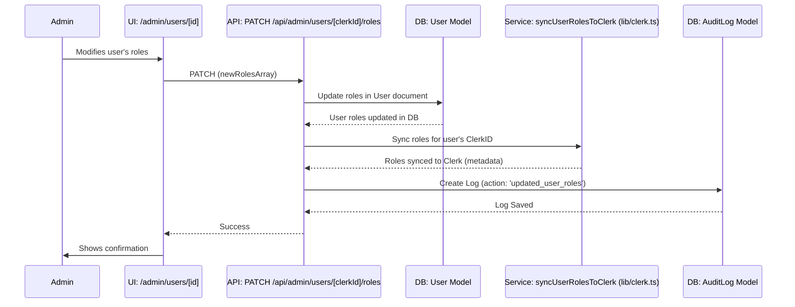

---

**ClaimBot Workflows: User Management & Role Assignment**

**1. Overview**

This document outlines the workflow for administrators to manage user accounts, including creating new users, updating user details, and assigning/modifying user roles. Proper user management and role assignment are critical for maintaining system security and ensuring users have appropriate access levels.

**2. Actors**

*   **Administrator (Admin/Superadmin):** Users with permissions to manage other users and their roles (typically 'admin' or 'superadmin' roles).

**3. Workflow Steps & Diagrams**

**3.1. Creating a New User**

1.  **Navigate to User Management Page:**
    *   The Administrator navigates to the user management section (e.g., [`/admin/users`](src/app/admin/users/page.tsx)).
2.  **Initiate New User Creation:**
    *   Admin clicks a "Create New User" or "Add User" button.
    *   **UI:** This likely navigates to a dedicated page like [`/admin/users/new/page.tsx`](src/app/admin/users/new/page.tsx) (not explicitly read, but a common pattern) or opens a modal dialog.
3.  **Enter New User Details:**
    *   Admin fills in the new user's information, which must include:
        *   Clerk ID (if known, or a mechanism to invite/link to Clerk)
        *   Email
        *   Name (optional)
        *   Department (optional)
        *   Designation (optional)
        *   Initial Roles (defaults to 'staff' if not specified)
        *   Salary (optional, for initial setup)
    *   **UI:** A form for new user creation.
4.  **Submit New User Form:**
    *   Admin submits the form.
    *   **API Call:** `POST /api/users` with the new user data.
    *   **Logic (Backend):**
        *   RBAC check: Verifies the performing user has 'users:create' permission (typically 'admin'/'superadmin').
        *   Validates input using `createUserSchema` from [`src/app/api/users/route.ts`](src/app/api/users/route.ts:1).
        *   Checks if a user with the same Clerk ID or email already exists in the local DB.
        *   Calculates `hourlyRate` if `salary` is provided.
        *   Creates a new document in the `User` collection.
        *   **Important:** The roles assigned here are stored in the local MongoDB. A separate step or an integrated part of user creation should ensure these roles are also synced to Clerk's public metadata for consistency (e.g., by calling `syncUserRolesToClerk` from [`lib/clerk.ts`](src/lib/clerk.ts:1)). The current `POST /api/users` does not show this sync explicitly.
    *   **Model:** New `User` document created.
    *   **Audit:** An `AuditLog` entry should be created for `created_user`.

**Sequence Diagram: Creating a New User**

**3.2. Viewing and Editing User Details (Including Roles)**

1.  **Navigate to User List/Detail Page:**
    *   Admin navigates to the user list ([`/admin/users`](src/app/admin/users/page.tsx)) and selects a user, or directly to a user's detail page ([`/admin/users/[id]`](src/app/admin/users/[id]/page.tsx:1), where `[id]` is the MongoDB `_id`).
    *   **API Call (for list):** `GET /api/users` (requires 'users:read:all' permission).
    *   **API Call (for detail):** `GET /api/users/[id]` (requires 'admin' or 'manager' role).
2.  **Modify User Details:**
    *   Admin edits fields such as name, department, designation, isActive status, and roles.
    *   **UI:** Form fields on [`/admin/users/[id]`](src/app/admin/users/[id]/page.tsx:1). The role selection is typically a dropdown or multi-select.
3.  **Save Changes:**
    *   Admin saves the modifications.
    *   **API Calls:**
        *   For general details (name, department, etc.): `PATCH /api/users/[id]` (MongoDB `_id`).
            *   **Logic (Backend):** RBAC check ('admin' role). Updates specified fields in the `User` model. Recalculates `hourlyRate` if `salary` changes.
        *   For role changes specifically (often a separate, more controlled action): `PATCH /api/admin/users/[clerkId]/roles`.
            *   **Logic (Backend):** RBAC check ('superadmin' role for this specific endpoint). Updates `roles` array in the `User` model. Crucially, calls `syncUserRolesToClerk` to update Clerk's public metadata.
    *   **Model:** `User` document updated.
    *   **Audit:** `AuditLog` entries for `updated_user` and/or `updated_user_roles`.

**Sequence Diagram: Editing User Roles**

**3.3. Deactivating/Deleting a User**

1.  **Select User for Action:**
    *   Admin identifies a user on the user list or detail page.
2.  **Perform Action:**
    *   **Deactivate:** Admin changes `isActive` status to `false`.
        *   **API Call:** `PATCH /api/users/[id]` with `{ isActive: false }`.
    *   **Delete:** Admin initiates deletion.
        *   **API Call:** `DELETE /api/users/[id]`.
        *   **Logic (Backend):** RBAC check ('admin' role). Deletes the `User` document from MongoDB.
        *   **Important:** Deleting the user from the local DB does *not* automatically delete them from Clerk. A separate process or manual step in Clerk would be needed to fully remove the user from the authentication system. The application should handle scenarios where a Clerk user might exist without a corresponding local DB entry.
    *   **Model:** `User` document updated (for deactivation) or deleted.
    *   **Audit:** `AuditLog` entry for `deactivated_user` or `deleted_user`.

**4. Data Models Involved**

*   **[`User`](src/models/User.ts:1):** Primary model for storing user information, including their roles.
*   **[`AuditLog`](src/models/AuditLog.ts:1):** Records user management actions.

**5. Key RBAC Permissions & Roles Involved**

*   **Creating Users:**
    *   Role: 'admin' or 'superadmin'.
    *   Permission: `users:create`.
*   **Reading Users:**
    *   All Users: Role 'admin' or 'superadmin', Permission `users:read:all`.
    *   Specific User: Role 'admin' or 'manager' (for `/api/users/[id]`).
*   **Updating User Details (non-role):**
    *   Role: 'admin'.
*   **Updating User Roles:**
    *   Role: 'superadmin' (for `/api/admin/users/[clerkId]/roles` which syncs to Clerk).
    *   Permission: `roles:manage` (defined in [`rbac.ts`](src/lib/rbac.ts:1) for 'superadmin').
*   **Deleting Users:**
    *   Role: 'admin'.

**6. Clerk Synchronization**

*   A critical aspect of role management is ensuring that roles assigned in the local ClaimBot database are synchronized with Clerk's `publicMetadata`. This is handled by the `syncUserRolesToClerk` function (likely in [`lib/clerk.ts`](src/lib/clerk.ts:1)), which should be called after any local role modification.
*   User creation also needs to consider how the Clerk user is created/invited and linked to the local DB record via `clerkId`.

---