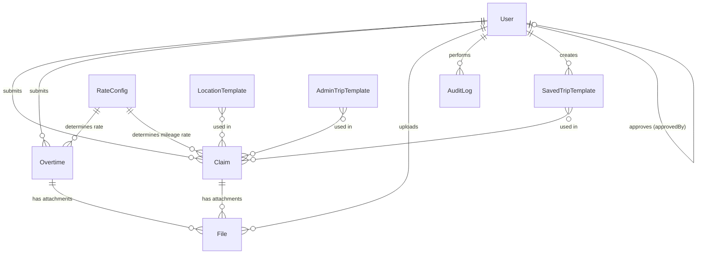

# ClaimBot: Data Model Reference

**Version**: 1.0  
**Last Updated**: June 6, 2025  
**Status**: Production Ready

This document provides a detailed description of each Mongoose data model used in the ClaimBot application, found within the `src/models/` directory.

## General Notes

*   All models include `createdAt` and `updatedAt` timestamps by default due to `{ timestamps: true }` in their schema options, unless otherwise specified for `AuditLog`.
*   `mongoose.models.ModelName || mongoose.model<IModelName>('ModelName', Schema)` is a common pattern to prevent model recompilation issues in Next.js development.

---

## 1. AdminTripTemplate

**File:** [`src/models/AdminTripTemplate.ts`](../../src/models/AdminTripTemplate.ts:1)  
**Interface:** `IAdminTripTemplate`  
**Purpose:** Represents trip templates defined by administrators, available globally for users to select when creating claims.

### Fields
*   `_id` (ObjectId): Unique identifier for the template.
*   `origin` (Location): Embedded object defining the starting point.
    *   `address` (String, required): Formatted address of the origin.
    *   `lat` (Number, required): Latitude of the origin.
    *   `lng` (Number, required): Longitude of the origin.
*   `destination` (Location): Embedded object defining the end point.
    *   `address` (String, required): Formatted address of the destination.
    *   `lat` (Number, required): Latitude of the destination.
    *   `lng` (Number, required): Longitude of the destination.
*   `roundTrip` (Boolean, required): Indicates if the template represents a round trip.
*   `label` (String, required): A user-friendly name or label for this template (e.g., "Office to Client X").

### Relationships
None explicit, but `origin` and `destination` use the `Location` type from [`src/types/location.ts`](../../src/types/location.ts:1).

### Validation
`required` for all fields and sub-fields.

### Indexes
None explicitly defined in this model file.

---

## 2. AuditLog

**File:** [`src/models/AuditLog.ts`](../../src/models/AuditLog.ts:1)  
**Interface:** `IAuditLog`  
**Purpose:** Records significant actions performed within the system for auditing and tracking purposes.

### Fields
*   `userId` (ObjectId, ref: 'User', required): The user who performed the action.
*   `action` (String, required): A string identifying the action performed (e.g., 'created_claim', 'updated_user_roles').
*   `target` (Object, required): Information about the entity that was affected.
    *   `collection` (String, required): The name of the MongoDB collection of the target document.
    *   `documentId` (ObjectId, required): The `_id` of the affected document in the target collection.
*   `details` (String, optional): Additional details or context about the action.
*   `timestamp` (Date, required, default: `Date.now`): When the action occurred. (Note: `timestamps: true` is not used here, `timestamp` is explicitly defined).

### Relationships
`userId` refers to the `User` model.

### Validation
`required` for `userId`, `action`, `target.collection`, `target.documentId`, `timestamp`.

### Indexes
None explicitly defined.

---

## 3. Claim

**File:** [`src/models/Claim.ts`](../../src/models/Claim.ts:1)  
**Interface:** `IClaim`  
**Purpose:** Represents an expense claim submitted by a user.

### Fields
*   `userId` (ObjectId, ref: 'User', required): The user who submitted the claim.
*   `date` (Date, required): The date the expense was incurred.
*   `project` (String, optional): Associated project for the claim.
*   `description` (String, optional): Description of the claim.
*   `tripMode` (String, enum: ['default', 'custom'], default: 'default'): Mode of the trip ('default' likely from office, 'custom' for user-defined origin).
*   `roundTrip` (Boolean, optional): Whether the trip was a round trip.
*   `origin` (String, optional): Textual description of the origin (used if `originLocation` not set).
*   `destination` (String, optional): Textual description of the destination.
*   `originLocation` (Object, optional): Structured location data for the origin.
    *   `lat` (Number)
    *   `lng` (Number)
    *   `formatted_address` (String)
*   `destinationLocation` (Object, optional): Structured location data for the destination.
    *   `lat` (Number)
    *   `lng` (Number)
    *   `formatted_address` (String)
*   `calculatedMileage` (Number, optional): Mileage calculated by the system (e.g., via Google Maps).
*   `expenses` (Object, optional): Nested object detailing various expense types.
    *   `mileage` (Number, optional): Claimed mileage amount (distinct from `calculatedMileage` which might be system-generated distance).
    *   `toll` (Number, optional)
    *   `petrol` (Number, optional)
    *   `meal` (Number, optional)
    *   `others` (Number, optional)
*   `mileageRate` (Number, optional): The mileage rate applied at the time of claim calculation.
*   `totalClaim` (Number, optional): The total calculated amount for the claim.
*   `attachments` (Array of ObjectId, ref: 'File'): List of file IDs linked to this claim.
*   `status` (String, required, enum: ['draft', 'submitted', 'approved', 'rejected', 'paid'], default: 'draft'): Current status of the claim.
*   `submittedAt` (Date, optional): Timestamp when the claim was submitted.
*   `approvedBy` (ObjectId, ref: 'User', optional): The user who approved/rejected the claim.
*   `approvedAt` (Date, optional): Timestamp of approval/rejection.
*   `remarks` (String, optional): Remarks from the approver.

### Relationships
`userId` and `approvedBy` refer to `User`. `attachments` refers to `File`.

### Validation
`required` and `enum` constraints.

### Indexes
None explicitly defined.

### Status Lifecycle
1. **draft** - Initial state, can be edited by submitter
2. **submitted** - Submitted for approval, awaiting review
3. **approved** - Approved by manager/admin, ready for payment
4. **rejected** - Rejected by approver with remarks
5. **paid** - Payment processed (updated by finance)

---

## 4. File

**File:** [`src/models/File.ts`](../../src/models/File.ts:1)  
**Interface:** `IFile`  
**Purpose:** Stores metadata about uploaded files, typically attachments for claims or overtime requests.

### Fields
*   `filename` (String, required): Original name of the uploaded file.
*   `mimetype` (String, optional): MIME type of the file.
*   `path` (String, required): Server-side path where the file is stored (e.g., `/uploads/filename.ext`).
*   `uploadedBy` (ObjectId, ref: 'User', required): The user who uploaded the file.
*   `linkedTo` (Object, required): Information linking the file to another document.
    *   `collection` (String, required, enum: ['claims', 'overtime']): The collection name of the linked document.
    *   `documentId` (ObjectId, required): The `_id` of the document in the `linkedTo.collection`.
*   `uploadedAt` (Date): Automatically added by `timestamps: true` as `createdAt`. The interface explicitly lists `uploadedAt`, but the schema uses `timestamps`. This might be a slight mismatch or `uploadedAt` is an alias for `createdAt`.

### Relationships
`uploadedBy` refers to `User`. `linkedTo` provides a polymorphic-like association.

### Validation
`required` and `enum` constraints.

### Indexes
None explicitly defined.

---

## 5. LocationTemplate

**File:** [`src/models/LocationTemplate.ts`](../../src/models/LocationTemplate.ts:1)  
**Interface:** `ILocationTemplate`  
**Purpose:** Represents individual named locations (points of interest) defined by administrators, likely used as predefined origins/destinations.

### Fields
*   `name` (String, required, trim, maxlength: 100): User-friendly name for the location (e.g., "Main Office", "Client HQ Site A").
*   `address` (String, required, trim, maxlength: 500): Full address of the location.
*   `lat` (Number, required, min: -90, max: 90): Latitude.
*   `lng` (Number, required, min: -180, max: 180): Longitude.

### Relationships
None.

### Validation
`required`, `trim`, `maxlength`, `min`/`max` for coordinates.

### Indexes
*   `{ name: 1 }`
*   `{ lat: 1, lng: 1 }`
*   `{ lat: 1, lng: 1 }, { name: 'location_2d' }` (Geospatial index).

---

## 6. Overtime

**File:** [`src/models/Overtime.ts`](../../src/models/Overtime.ts:1)  
**Interface:** `IOvertime`  
**Purpose:** Represents an overtime request submitted by a user.

### Fields
*   `userId` (ObjectId, ref: 'User', required): The user submitting the request.
*   `date` (Date, required): Date the overtime was worked.
*   `startTime` (String, required, format HH:MM): Start time of overtime.
*   `endTime` (String, required, format HH:MM): End time of overtime.
*   `reason` (String, required): Justification for the overtime.
*   `hoursWorked` (Number, optional): Calculated hours of overtime.
*   `rateMultiplier` (Number, optional): Multiplier applied to the hourly rate (e.g., 1.5, 2.0).
*   `hourlyRate` (Number, optional): The user's hourly rate at the time of calculation.
*   `totalPayout` (Number, optional): Total calculated overtime pay.
*   `attachments` (Array of ObjectId, ref: 'File'): List of file IDs linked to this request.
*   `status` (String, required, enum: ['submitted', 'approved', 'rejected', 'paid'], default: 'submitted'): Current status of the request.
*   `approvedBy` (ObjectId, ref: 'User', optional): The user who approved/rejected the request.
*   `approvedAt` (Date, optional): Timestamp of approval/rejection.
*   `remarks` (String, optional): Remarks from the approver.

### Relationships
`userId` and `approvedBy` refer to `User`. `attachments` refers to `File`.

### Validation
`required` and `enum` constraints.

### Indexes
None explicitly defined.

### Status Lifecycle
1. **submitted** - Initial state after submission, awaiting approval
2. **approved** - Approved by manager/admin, ready for payment
3. **rejected** - Rejected by approver with remarks
4. **paid** - Payment processed (updated by finance)

### Business Rules
- Maximum 18 hours of overtime per month per user
- Weekday overtime must start after 8 PM
- User's salary must be verified before submitting overtime
- Rate multiplier determined by day type and user designation

---

## 7. RateConfig

**File:** [`src/models/RateConfig.ts`](../../src/models/RateConfig.ts:1)  
**Interface:** `IRateConfig`  
**Purpose:** Stores configuration for different rates, such as mileage rates or overtime multipliers.

### Fields
*   `type` (String, required, enum: ['mileage', 'overtime_multiplier']): The type of rate being configured.
*   `value` (Number, optional): The rate value itself (e.g., rate per km for 'mileage').
*   `condition` (Object, optional): Conditions for applying an 'overtime_multiplier'.
    *   `dayType` (String, optional): E.g., "weekday", "weekend", "public_holiday".
    *   `designation` (String, optional): User designation this multiplier applies to.
*   `multiplier` (Number, optional): The overtime multiplier value (e.g., 1.5, 2.0).
*   `effectiveDate` (Date, required): The date from which this rate configuration is effective.

### Relationships
None.

### Validation
`required` and `enum` constraints.

### Indexes
None explicitly defined.

### Usage Examples
```javascript
// Mileage rate configuration
{
  type: 'mileage',
  value: 0.5, // RM 0.50 per km
  effectiveDate: new Date('2025-01-01')
}

// Overtime multiplier for weekends
{
  type: 'overtime_multiplier',
  multiplier: 2.0, // Double pay
  condition: {
    dayType: 'weekend'
  },
  effectiveDate: new Date('2025-01-01')
}
```

---

## 8. SavedTripTemplate

**File:** [`src/models/SavedTripTemplate.ts`](../../src/models/SavedTripTemplate.ts:1)  
**Interface:** `ISavedTripTemplate`  
**Purpose:** Represents trip templates saved by individual users for their personal convenience.

### Fields
*   `_id` (ObjectId): Unique identifier for the template.
*   `userId` (String, required): The Clerk User ID of the user who saved this template. (Note: Changed from ObjectId to String in the model to align with Clerk ID format).
*   `origin` (Location): Embedded object for the starting point.
    *   `address` (String, required): Formatted address.
    *   `lat` (Number, required): Latitude.
    *   `lng` (Number, required): Longitude.
*   `destination` (Location): Embedded object for the end point.
    *   `address` (String, required): Formatted address.
    *   `lat` (Number, required): Latitude.
    *   `lng` (Number, required): Longitude.
*   `roundTrip` (Boolean, required): Indicates if it's a round trip.
*   `label` (String, required): User-defined label for this template.

### Relationships
`userId` links to a user (conceptually, via Clerk ID). `origin` and `destination` use the `Location` type from [`src/types/location.ts`](../../src/types/location.ts:1).

### Validation
`required` for all fields and sub-fields.

### Indexes
None explicitly defined.

---

## 9. User

**File:** [`src/models/User.ts`](../../src/models/User.ts:1)  
**Interface:** `IUser`  
**Purpose:** Represents an application user, linking to Clerk authentication and storing application-specific user data.

### Fields
*   `clerkId` (String, required, unique): The user's ID from Clerk.
*   `name` (String, optional): User's full name.
*   `email` (String, required, unique): User's email address.
*   `department` (String, optional): User's department.
*   `designation` (String, optional): User's job designation/title.
*   `roles` (Array of String, enum: UserRole, required, default: ['staff']): List of roles assigned to the user.
*   `monthlySalary` (Number, optional): User's monthly salary.
*   `hourlyRate` (Number, optional): User's hourly rate (if applicable).
*   `salaryVerificationStatus` (String, enum: ['pending', 'verified', 'rejected'], optional): Status of their salary verification.
*   `salarySubmittedAt` (Date, optional): When salary info was last submitted.
*   `salaryVerifiedAt` (Date, optional): When salary info was last verified.
*   `salaryVerifiedBy` (String, optional): Clerk ID of the admin who verified the salary.
*   `lastSalaryReviewYear` (Number, optional): The year the user last had their salary reviewed/submitted.
*   `monthlyOvertimeHours` (Map, of: Number, default: {}): Stores total overtime hours per month (key: "YYYY-MM", value: hours).
*   `isActive` (Boolean, default: true): Whether the user account is active.

### Methods (on `IUser` document)
*   `hasRole(role: UserRole): boolean`: Checks if the user has a specific role (superadmin always true).
*   `hasAnyRole(roles: UserRole[]): boolean`: Checks if the user has any of the specified roles (superadmin always true).

### Virtuals
*   `canReviewSalary` (Boolean, get): Computed based on `lastSalaryReviewYear` and current year. True if `lastSalaryReviewYear` is not set or is less than the current year.

### Middleware
*   `pre('save')`: Ensures the 'staff' role is always included in the `roles` array before saving.

### Relationships
Implicitly linked to `Claim`, `Overtime`, `AuditLog`, `File` via `userId` or `uploadedBy` fields in those models.

### Validation
`required`, `unique`, `enum` constraints.

### Indexes
`clerkId` and `email` are unique.

### UserRole Enum
```typescript
type UserRole = 'staff' | 'manager' | 'finance' | 'admin' | 'superadmin';
```

### Salary Verification Workflow
1. **not_submitted** - Initial state, no salary information provided
2. **pending** - Salary submitted, awaiting verification
3. **verified** - Salary verified by manager/admin
4. **rejected** - Salary rejected, needs resubmission

---

## 10. Data Relationships Overview



## 11. Common Query Patterns

### User Management
```javascript
// Find users by role
const admins = await User.find({ roles: { $in: ['admin', 'superadmin'] } });

// Find users with pending salary verification
const pendingSalary = await User.find({ salaryVerificationStatus: 'pending' });
```

### Claims and Overtime
```javascript
// Find user's pending submissions
const pendingClaims = await Claim.find({ 
  userId: userId, 
  status: { $in: ['draft', 'submitted'] } 
});

// Find submissions requiring approval
const needsApproval = await Claim.find({ status: 'submitted' })
  .populate('userId', 'name email department');
```

### Audit Trail
```javascript
// Find all actions by a user
const userActions = await AuditLog.find({ userId })
  .sort({ timestamp: -1 })
  .limit(50);

// Find actions on a specific document
const documentHistory = await AuditLog.find({
  'target.collection': 'claims',
  'target.documentId': claimId
});
```

## 12. Related Documentation

- **[RBAC and Authentication](../technical/rbac-and-auth.md)** - User roles and permissions
- **[API Reference](api-routes.md)** - How to interact with these models via API
- **[System Architecture](../architecture/system-overview.md)** - Overall system design
- **[Workflow Guides](../guides/workflows/)** - Business process documentation

---

**Next Steps**: Review the [API Reference](api-routes.md) to understand how to interact with these data models through the application's REST API.