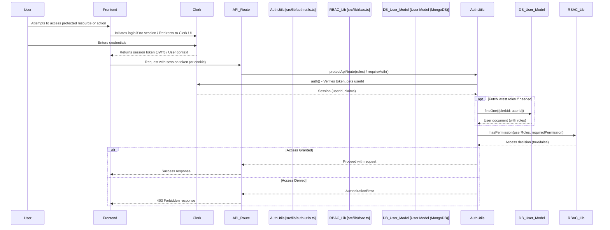

# ClaimBot: RBAC and Authentication System

**Version**: 1.0  
**Last Updated**: June 6, 2025  
**Status**: Production Ready

## 1. Introduction

ClaimBot employs a robust security model combining Clerk for primary user authentication and a custom Role-Based Access Control (RBAC) system for fine-grained authorization. This document details the components and logic of this system, primarily centered around [`src/lib/rbac.ts`](../../src/lib/rbac.ts:1) and its integration with Clerk via [`src/lib/auth-utils.ts`](../../src/lib/auth-utils.ts:1).

## 2. Core RBAC Components ([`src/lib/rbac.ts`](../../src/lib/rbac.ts:1))

### 2.1 User Roles (`UserRole` type from [`models/User.ts`](../../src/models/User.ts:1))

*   `staff` - Basic user role for submitting claims and overtime
*   `manager` - Team management and approval capabilities
*   `finance` - Financial oversight and reporting access
*   `admin` - System administration and user management
*   `superadmin` - Full system access and role management

### 2.2 Role Hierarchy (`ROLE_HIERARCHY`)

Defines a numerical hierarchy where higher roles inherit capabilities of lower roles:

*   `staff`: 1
*   `manager`: 2 (inherits staff permissions implicitly in some checks)
*   `finance`: 3 (inherits staff permissions implicitly in some checks)
*   `admin`: 4 (inherits staff, manager, finance permissions implicitly in some checks)
*   `superadmin`: 5 (has all permissions and can access all roles)

### 2.3 Role Permissions (`ROLE_PERMISSIONS`)

This is the core mapping of roles to specific action strings (permissions).

#### **`staff` Permissions:**
*   `claims:create`: Can create new expense claims
*   `claims:read:own`: Can read their own expense claims
*   `claims:update:own`: Can update their own draft/submitted expense claims
*   `overtime:create`: Can create new overtime requests
*   `overtime:read:own`: Can read their own overtime requests
*   `overtime:update:own`: Can update their own draft/submitted overtime requests
*   `files:upload`: Can upload files (attachments)
*   `files:read:own`: Can read their own uploaded files
*   `profile:read:own`: Can read their own user profile
*   `profile:update:own`: Can update their own user profile
*   `salary:submit:own`: Can submit their salary information for review
*   `salary:read:own`: Can read their own salary information

#### **`manager` Permissions:** (Inherits `staff` permissions through hierarchy)
*   `claims:approve`: Can approve/reject claims (likely for their team)
*   `claims:read:team`: Can read claims submitted by their team members
*   `overtime:approve`: Can approve/reject overtime requests (likely for their team)
*   `overtime:read:team`: Can read overtime requests from their team members
*   `users:read:team`: Can view profiles/details of their team members
*   `reports:read:team`: Can view reports relevant to their team
*   `analytics:read:basic`: Can access basic analytics
*   `admin:access:approvals`: Specific access to the approvals section in the admin panel
*   `salary:verify:team`: Can verify salary submissions for their team members
*   `salary:read:team`: Can read salary information of their team members

#### **`finance` Permissions:** (Inherits `staff` permissions through hierarchy)
*   `claims:read:all`: Can read all expense claims across the organization
*   `overtime:read:all`: Can read all overtime requests across the organization
*   `reports:read:all`: Can view all reports
*   `reports:export`: Can export reports
*   `claims:update:status`: Can update the status of claims (e.g., to 'paid')
*   `overtime:update:status`: Can update the status of overtime (e.g., to 'paid')
*   `analytics:read:financial`: Can access financial analytics

#### **`admin` Permissions:** (Inherits `staff`, `manager`, `finance` permissions through hierarchy)
*   `users:create`: Can create new user accounts
*   `users:read:all`: Can read all user profiles
*   `users:update:all`: Can update any user's profile information
*   `users:delete`: Can delete user accounts
*   `config:read`: Can read system configurations (e.g., rates)
*   `config:update`: Can update system configurations
*   `config:create`: Can create new system configurations
*   `rates:create`, `rates:update`, `rates:delete`: Manage rate configurations
*   `audit-logs:read`: Can view system audit logs
*   `system:config`: General permission for system-level configurations
*   `admin:access`: General access to the admin panel
*   `analytics:read:full`: Can access all analytics
*   `admin:access:users`: Specific access to user management in admin
*   `admin:access:rates`: Specific access to rate configuration in admin
*   `admin:access:audit-logs`: Specific access to audit logs in admin
*   `admin:access:trip-templates`: Can manage admin-defined trip templates
*   `salary:verify:all`: Can verify any user's salary submission
*   `salary:read:all`: Can read any user's salary information
*   `admin:access:salary-verification`: Specific access to salary verification section in admin

#### **`superadmin` Permissions:** (Has all permissions from all other roles, plus unique superadmin permissions)
*   `roles:manage`: Can manage user roles (assign/revoke, potentially define roles - though roles are hardcoded currently)
*   `system:admin`: Highest level system administration capabilities
*   `users:impersonate`: Can impersonate other users (if feature exists)
*   `data:export:all`: Can export all system data
*   `system:maintenance`: Can put the system into maintenance mode (if feature exists)

### 2.4 Permission Logic Functions

*   `getPermissionsForRoles(userRoles)`: Aggregates all permissions for a given set of roles, respecting hierarchy (lower roles' permissions are included for higher roles) and the `superadmin` omnipotence.
*   `hasPermission(userRoles, permission)`: Checks if the user has one specific permission.
*   `hasAnyPermission(userRoles, permissions)`: Checks if the user has at least one of the listed permissions.
*   `hasAllPermissions(userRoles, permissions)`: Checks if the user has all of the listed permissions.
*   `hasRole(userRoles, requiredRole)`: Checks if a user effectively has a given role, considering the `ROLE_HIERARCHY` (e.g., an 'admin' `hasRole` 'manager').
*   `hasAnyRole(userRoles, requiredRoles)`: Checks if a user effectively has any of the specified roles, considering hierarchy.

### 2.5 Protected Routes (`PROTECTED_ROUTES`)

*   An array of `RouteConfig` objects defining access rules for specific URL paths (both UI pages and API routes).
*   Each `RouteConfig` specifies:
    *   `path`: The base path to protect (e.g., `/admin`, `/api/admin`).
    *   `requiredRoles`: An array of `UserRole`s that can access the route.
    *   `requiredPermissions`: An array of permission strings. If present, the user must have *all* these permissions.
    *   `isApiRoute`: Boolean flag.
    *   `allowHierarchy`: If true, users with roles higher in the hierarchy than those listed in `requiredRoles` can also access the route. If false, only an exact role match (or `superadmin`) is allowed.
*   `canAccessRoute(userRoles, path)`: The function that evaluates these rules for a given user and path. It checks for a matching `routeConfig` and then validates against `requiredRoles` (respecting `allowHierarchy`) and `requiredPermissions`. Superadmin always has access. Public routes (not listed) are accessible by default.

### 2.6 Other Utilities in `rbac.ts`

*   `validateRoles(roles)`: Filters an array of strings to ensure they are valid `UserRole`s.
*   `getRoleDisplayName(role)`: Returns a human-readable name for a role.
*   `canManageRole(managerRoles, targetRole)`: Determines if a user can manage another user's role based on hierarchy (e.g., 'admin' can manage 'manager', but not vice-versa, 'superadmin' can manage all except another 'superadmin' unless they are one).

## 3. Clerk Integration & Authentication Utilities ([`src/lib/auth-utils.ts`](../../src/lib/auth-utils.ts:1))

This module acts as a bridge between Clerk's authentication and the custom RBAC system.

### 3.1 Fetching User Roles

*   `getUserRoles()`: Retrieves the current user's roles from Clerk's session claims (`publicMetadata.roles`).
*   `extractRolesFromUser(userId)`: Fetches user roles directly from Clerk user object using `clerkClient().users.getUser()`. This provides the most up-to-date roles, potentially bypassing session staleness.

### 3.2 Current User Information

*   `getCurrentUserId()`: Returns the Clerk `userId` of the currently authenticated user.

### 3.3 RBAC Wrappers for Current User

*   `userHasRole(role)`, `userHasAnyRole(roles)`, `userHasPermission(permission)`, `userHasAnyPermission(permissions)`: These functions simplify RBAC checks by automatically getting the current user's roles and then calling the corresponding core functions from [`rbac.ts`](../../src/lib/rbac.ts:1).
*   `canAccessPath(path)`: Checks if the current user can access a specific UI path.

### 3.4 Route Protection Middleware/Helpers

*   `requireAuth()`: Ensures a user is authenticated; throws an error if not.
*   `requireRole(role)`, `requireAnyRole(roles)`, `requirePermission(permission)`, `requireAnyPermission(permissions)`: These build upon `requireAuth()` and further check for specific roles/permissions, throwing errors if checks fail. They primarily use roles extracted from session claims.
*   **`protectApiRoute(options)`**: This is a key function for securing API routes.
    *   It calls `requireAuth()`.
    *   It fetches user roles using `extractRolesFromUser(session.userId)` (ensuring fresh roles from Clerk).
    *   It checks against `options.roles` and/or `options.permissions`.
    *   The `options.requireAll` flag determines if all specified roles/permissions are needed or if any one suffices.
    *   Throws an error if authorization fails.

### 3.5 Role Synchronization with Clerk

*   While not directly in `auth-utils.ts`, the function `syncUserRolesToClerk(targetUserId)` (imported from [`@/lib/clerk`](../../src/lib/clerk.ts:1) and used in [`api/admin/users/userId/roles/route.ts`](../../src/app/api/admin/users/userId/roles/route.ts:1)) is crucial. When roles are updated in the local MongoDB `User` model, this function must be called to update the `publicMetadata.roles` in the corresponding Clerk user object. This ensures that session claims and direct Clerk user data remain consistent.

## 4. Authentication & Authorization Sequence

## 5. Key Considerations & Best Practices

### 5.1 Source of Truth for Roles
While roles are stored in the local `User` model (MongoDB) and also in Clerk's `publicMetadata`, it's important to document which is considered the ultimate source of truth and how synchronization (`syncUserRolesToClerk`) ensures consistency. `protectApiRoute` using `extractRolesFromUser` suggests a preference for Clerk's data as being fresher for critical checks.

### 5.2 Permission Granularity
The permission strings (e.g., `claims:create`, `users:read:all`) are well-defined. A glossary mapping each permission string to the exact capability it grants is essential.

### 5.3 Hierarchy Implications
The role hierarchy means that assigning a higher role automatically grants permissions of lower roles. This needs to be clearly understood by administrators.

### 5.4 `superadmin` Power
The `superadmin` role bypasses most standard permission checks. This is a powerful feature that needs to be handled with care.

### 5.5 `PROTECTED_ROUTES` Maintenance
As the application grows, the `PROTECTED_ROUTES` array in [`src/lib/rbac.ts`](../../src/lib/rbac.ts:1) must be diligently maintained to ensure new routes are appropriately secured.

### 5.6 Client-Side RBAC
UI elements are often conditionally rendered based on roles/permissions using the `useRBAC` hook. Documenting how this hook works and how it consumes the RBAC logic is important for frontend developers.

## 6. Permission Glossary

### Claims Permissions
- `claims:create` - Create new expense claims
- `claims:read:own` - View own expense claims
- `claims:read:team` - View team member expense claims
- `claims:read:all` - View all expense claims in organization
- `claims:update:own` - Edit own expense claims
- `claims:update:status` - Update claim status (e.g., mark as paid)
- `claims:approve` - Approve or reject expense claims

### Overtime Permissions
- `overtime:create` - Create new overtime requests
- `overtime:read:own` - View own overtime requests
- `overtime:read:team` - View team member overtime requests
- `overtime:read:all` - View all overtime requests in organization
- `overtime:update:own` - Edit own overtime requests
- `overtime:update:status` - Update overtime status (e.g., mark as paid)
- `overtime:approve` - Approve or reject overtime requests

### User Management Permissions
- `users:create` - Create new user accounts
- `users:read:all` - View all user profiles
- `users:read:team` - View team member profiles
- `users:update:all` - Edit any user's profile
- `users:delete` - Delete user accounts
- `users:impersonate` - Impersonate other users (superadmin only)

### System Administration Permissions
- `admin:access` - Access admin panel
- `admin:access:users` - Access user management section
- `admin:access:rates` - Access rate configuration section
- `admin:access:audit-logs` - Access audit logs section
- `admin:access:approvals` - Access approvals section
- `admin:access:salary-verification` - Access salary verification section
- `admin:access:trip-templates` - Access trip template management

### Configuration Permissions
- `config:read` - View system configurations
- `config:update` - Update system configurations
- `config:create` - Create new configurations
- `rates:create` - Create rate configurations
- `rates:update` - Update rate configurations
- `rates:delete` - Delete rate configurations

### Reporting & Analytics Permissions
- `reports:read:team` - View team reports
- `reports:read:all` - View all reports
- `reports:export` - Export reports
- `analytics:read:basic` - Access basic analytics
- `analytics:read:financial` - Access financial analytics
- `analytics:read:full` - Access all analytics

### File & Profile Permissions
- `files:upload` - Upload file attachments
- `files:read:own` - Access own uploaded files
- `profile:read:own` - View own profile
- `profile:update:own` - Update own profile

### Salary Management Permissions
- `salary:submit:own` - Submit own salary information
- `salary:read:own` - View own salary information
- `salary:read:team` - View team member salary information
- `salary:read:all` - View all salary information
- `salary:verify:team` - Verify team member salary submissions
- `salary:verify:all` - Verify any salary submission

### System-Level Permissions
- `roles:manage` - Manage user roles (superadmin only)
- `system:admin` - System administration capabilities
- `system:config` - System configuration access
- `system:maintenance` - System maintenance mode
- `data:export:all` - Export all system data
- `audit-logs:read` - View audit logs

## 7. Related Documentation

- **[System Architecture](../architecture/system-overview.md)** - Overall system design
- **[Data Models](../reference/data-models.md)** - User and role data structures
- **[API Reference](../reference/api-routes.md)** - Protected endpoint documentation
- **[User Management Workflow](../guides/workflows/user-management.md)** - Role assignment processes

---

**Next Steps**: Review the [Data Models](../reference/data-models.md) documentation to understand how roles are stored and managed in the database.